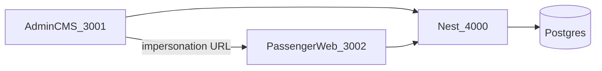
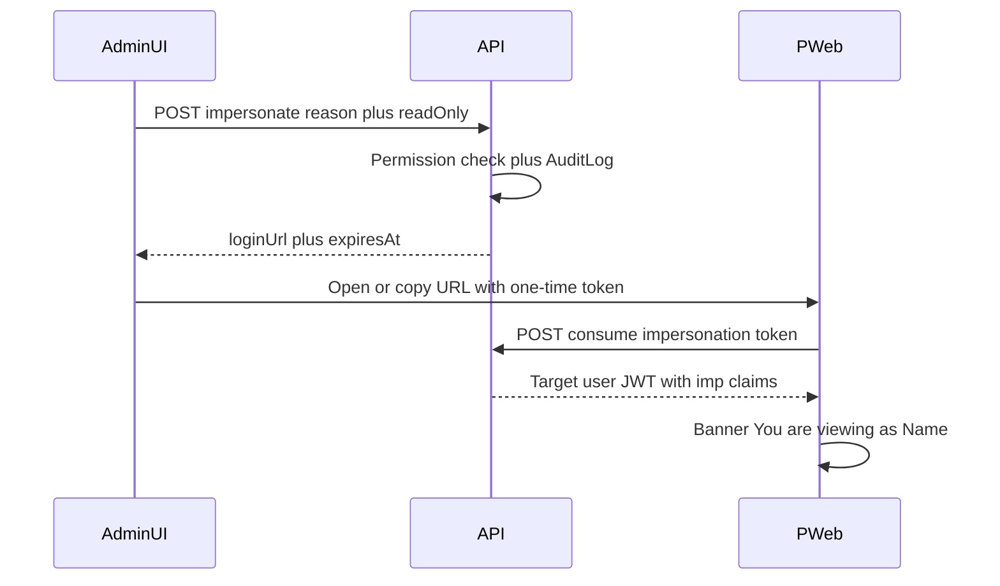

# CAN-GO Admin Ops CMS (control plane)

Today [`apps/admin`](apps/admin) is a Phase 1e prototype: one unrouted page, inline styles, raw JSON KYC detail. This build replaces it with a **production Admin Ops CMS** — every platform domain operable from `:3001`, with **Login As User** as a hard requirement.

CAN-GO is a **marketplace transfer** loop (request → bids → pay → trip), not Uber auto-dispatch. The CMS is the command center for that loop.

Previous draft treated support tickets, fine-grained RBAC, and similar as out of scope. **That is reversed.** The sidebar and modules below are the product. Screens are backed by real APIs and new Prisma models; we do not ship hollow nav items.



## Visual language

Keep CAN-GO dark ops: `#0f1419` / `#121a24` / `#1a2332`, accent `#3dd68c`, danger `#f8b4b4`. IBM Plex Sans + IBM Plex Mono. Dense tables, drawers, KPI strips, charts. CSS variables + primitives in `apps/admin/components/ui`. Lightweight charts (e.g. uPlot or Chart.js) for dashboard/finance.

## Sidebar IA (locked)

```
OVERVIEW
  Command Center
  Live Operations
  Analytics
PEOPLE
  All Users
  Passengers
  Drivers
  KYC
  Vehicles
  Suspended Accounts
MARKETPLACE
  Ride Requests
  Active Trips
  Completed Rides
  Cancelled Rides
  Bids / Offers
  Live Map
FINANCE
  Overview
  Transactions
  Payments
  Refunds
  Driver Earnings
  Commission
  Reconciliation
PRICING
  Fare Rules
  Service Types
  Zones
  Taxes
  Promotions
TRUST AND SAFETY
  Ratings
  Flagged Chats
  Risk Center
  Disputes
  Watchlist
SUPPORT
  Cases
  Unassigned
  Assigned to Me
  Escalations
GROWTH
  Promotions
  Referrals
  VIP
  Campaigns
  Retention
CONTENT
  CMS Pages
  Catalog
  FAQs
  Legal Pages
  App Content
COMMUNICATION
  Notifications
  Push / Email / SMS
  Templates
REPORTS
  Ride / Financial / Driver / User reports
  Custom Export
ADMINISTRATION
  Admin Users
  Roles and Permissions
  Audit Logs
  Login / Security Logs
PLATFORM
  System Health
  Webhooks
  Integrations
  API / Errors
  Feature Flags
  Settings
```

Nav items hide when the signed-in admin lacks the matching permission.

---

## 1. Login As User / impersonation (MUST HAVE)

Never reveal or reset the target password. Admin identity stays in the audit trail; the issued session is a **separate short-lived impersonation session**.

**Flow**



On User 360 and driver/passenger profiles:

- Login as user
- Copy secure login URL
- Open as user (new tab)
- Return to Admin (closes impersonation / returns to `:3001`)
- Toggle: **read-only impersonation**
- **Reason required** (min length) before issue

**Backend**

- New `ImpersonationSession`: `adminId`, `targetUserId`, `reason`, `readOnly`, `tokenHash`, `expiresAt` (10–15 min), `consumedAt`, `revokedAt`, `ip`, `userAgent`
- `POST /admin/users/:id/impersonate` `{ reason, readOnly }` → `{ loginUrl, expiresAt, sessionId }` — permission `users.impersonate`
- `POST /auth/impersonation/consume` `{ token }` → access JWT with extra claims: `imp: true`, `impBy`, `impSid`, `ro`
- JWT/guard: impersonation access TTL matches remaining session life; **no refresh rotation** (cannot extend past expiry)
- Write APIs (create ride, pay, chat send, KYC upload, etc.) **reject** when `ro === true`; mutate-as-user when `ro === false` still audited as `IMPERSONATED_WRITE` with `impBy`
- `POST /auth/impersonation/end` — revoke session; client returns to admin
- Sweeper expires unused tokens

**Clients**

- **Passenger:** [`apps/web-passenger`](apps/web-passenger) landing `/impersonate?t=` consumes token, stores session, persistent **banner**: “You are viewing CAN-GO as {fullName}” + Return to Admin. Driver Web does not exist — do **not** rebuild Flutter.
- **Driver:** same token consumed by a dedicated **Driver Preview** route in admin or a thin Next page (`/preview/driver`) that calls driver APIs as the impersonated user (profile, vehicles, open requests, earnings). Copy URL still works for that preview.

**Audit (forensic):** actor admin, action `USER_IMPERSONATE_ISSUE` / `CONSUME` / `END` / `WRITE`, target user, reason, readOnly, before/after N/A, IP, device, timestamp.

---

## 2. Executive + Live Operations dashboard

Replace “a few KPI chips” with two overview surfaces plus Analytics.

**Command Center (home)** — three KPI bands:

- **Users:** total, new today / 7D / 30D, active passengers, active drivers, online drivers (`DriverLocationCurrent` recent), suspended, pending KYC
- **Marketplace:** requests today, open requests, bids received, avg bids/ride, accepted, in progress, completed, cancelled, admin cancelled, completion rate, cancellation rate
- **Revenue:** GMV today / 7D / 30D, platform revenue, commission, taxes, refunds, failed payments, avg ride value — from `Payment` + `priceSnapshot` (`driverEarning`, commission, tax) + new `Refund` rows

**Live Operations** — active trips, waiting requests, online drivers, failed payments, KYC backlog, SLA-breached cases (when cases exist)

**Analytics** — range `today | 7d | 30d | 90d | 12m | custom`:

- Revenue trend
- **Ride funnel (critical):** Requested → Bids → Accepted → Paid → Started → Completed
- Registrations trend; driver vs passenger growth
- Ride volume; payment success/failure
- Cancellation reasons (from `RideEvent` payloads; unknown → Unspecified)
- Service type distribution
- KYC approval rate
- Avg bid amount; avg time to first bid; avg time to accepted bid
- Geographic demand (ride `fromLat/fromLng` clustered)

`GET /admin/dashboard/kpis?range=` and `GET /admin/dashboard/series?metric=&range=` — permission `dashboard.view`.

---

## 3. Global command palette

Topbar search is a **command palette**, not a filter box.

- Shortcut **Ctrl/Cmd+K**
- `GET /admin/search?q=` across: passenger/driver name, email, phone, user id, ride id, payment id, `providerRef`, vehicle plate, promo code, KYC driver, location labels
- Prefix hints: `CG-RIDE-…` (display id or cuid), email `@`, phone `+`
- Results grouped (Users, Rides, Payments, Vehicles, Promos); Enter opens **drawer** or 360 page
- Commands mixed in when permitted: “Suspend…”, “Login as…”, “Issue refund…”

Optional `publicCode` on Ride (e.g. `CG-RIDE-19281`) if cuid is too opaque for search UX; otherwise index short suffixes.

---

## 4. User 360° profile

Directory rows drill into a **360** page (`/users/[id]`), not a JSON card.

- **Identity:** name, phone, email, role, registration, last login, phone verified
- **Account:** active / suspended / VIP / risk score + flags
- **Activity:** last seen, last device, IP/login history (`UserSession`)
- **Marketplace:** rides total/completed/cancelled, spend or earnings, avg rating
- **Financial:** payments, refunds, commission (driver)
- **Trust:** flagged chats, ratings, KYC status, open cases, watchlist
- **Timeline (chronological):** Registered → Verified phone → KYC submitted → Approved → Ride requested → Payment → Complaint/case → Admin actions (`AuditLog` + domain events)
- Actions (permission-gated): **Login As | Suspend | VIP | View Rides | View Payments | Audit History**

`GET /admin/users/:id/360`

---

## 5. Admin roles and permissions

Resource/action permissions. Seeded roles:

- Super Admin (all)
- Operations Admin
- KYC Officer
- Finance Admin
- Support Agent
- Content Manager
- Marketing Manager
- Read-only Analyst

Examples: `rides.view`, `rides.cancel`, `users.impersonate`, `users.suspend`, `payments.refund`, `kyc.approve`, `cms.edit`, `pricing.edit`, `roles.manage`

**Especially restricted** (Super Admin + explicitly granted): impersonate, refund, suspend, pricing.edit, roles.manage.

Schema: `AdminRole`, `AdminRolePermission` (or JSON list), `User.adminRoleId` for `ADMIN` users. `SUPER_ADMIN` bypasses checks. Nest `@RequirePermission('…')` on every admin mutation. UI hides buttons the role cannot use.

Administration → Admin Users + Roles matrix editor.

---

## 6–7. Finance control center and refunds

`PaymentProvider.refund()` already exists (Dev + Stripe) but **no admin refund API or Refund table**.

Add `Refund`: paymentId, amount, currency, type `FULL|PARTIAL`, reason, internalNote, status, gatewayRefundId, gatewayResponse, requestedById, approvedById, createdAt.

**Finance Overview:** waterfall Gross Booking Value → Refunds → Driver share → Gateway fee (snapshot or 0 if unknown) → Tax → **CAN-GO net revenue**

Also: transactions, payment attempts, success/fail, refunds, driver earnings (from frozen `priceSnapshot.driverEarning`), platform commission, taxes, settlement/reconciliation views, filters (date/provider/status), **CSV/XLSX export** (`reports.export`).

**Refunds and Disputes:** from ride or payment → Issue refund (full/partial, reason, internal notes). Optional two-step approve if role is Support vs Finance. Status + gateway response + audit. Disputes can share `SupportCase` type `DISPUTE` or a `Dispute` row linked to payment/ride.

`POST /admin/payments/:id/refund` — permission `payments.refund`.

---

## 8. Support / case management

New `SupportCase`: status (`OPEN|ASSIGNED|ESCALATED|RESOLVED`), slaDueAt, assigneeId, linked `passengerId`, `driverId`, `rideId`, `paymentId`, `chatThreadId`, messages/notes.

Queues: Open, Assigned to me, Unassigned, Escalated, SLA breached. Agent can **Login As** from the case (same impersonation permission).

---

## 9. Fraud / risk center

Computed + stored:

- New `RiskFlag`, `WatchlistEntry`
- Signals from existing data: multi-account hints (device/IP), excessive cancels, payment failures, promo/referral abuse, flagged chats, high refund rate, stale/odd GPS
- Score band: Low | Medium | High | Critical
- Actions: watchlist, block/suspend (existing flag)

`GET /admin/risk/accounts` — permission `risk.view` / `risk.act`

---

## 10. Driver operations center

Drivers list as an ops board, not a directory dump:

Online / Offline / Busy / On trip / Pending KYC / Suspended / docs expiring / vehicle status; earnings, acceptance rate, cancel rate, completed trips, rating, last location, last active.

Detail: View on map | Login As | Suspend | Vehicle | Documents | Rides.

Vehicles get their own People → Vehicles table (plate search for command palette).

---

## 11. Advanced live operations map

OSM/Leaflet (Photon/OSM stack):

- Online drivers, active trips, waiting requests
- Pickup and drop-off points, driver clusters, demand heatmap
- Filters: ride status, service type, city/zone
- Click driver → mini profile; click trip → live ride drawer
- Poll `GET /admin/ops/map` (Socket.IO `admin:ops` if already available)

---

## 12. Notification center

Beyond listing `NotificationDelivery`:

- Channels: Push | Email | SMS | In-app
- Send: individual, drivers, passengers, city, VIP, custom segment
- Schedule, templates (`NotificationTemplate`), delivery stats, failures
- Open/click only where a provider actually returns them; otherwise omit or “n/a”

Uses existing FCM / `SmsProvider`; email may be stubbed until an EmailProvider exists — UI still records intended sends.

---

## 13. Growth analytics

Promos and referrals stay, plus:

- Promo usage, discount cost, conversion
- Referral signups and first-ride conversion
- VIP conversion
- Repeat ride rate, returning users
- Cohort retention (registration week → rides)
- Campaigns as scheduled notification + promo bundles if no separate Campaign table yet

---

## 14. Forensic audit log

Extend [`AuditLog`](backend/prisma/schema.prisma): `before`, `after`, `reason`, `device` (keep actor, action, resource, resourceId, ip, createdAt).

Always log: Login As, refund, KYC approve/reject, suspend, pricing change, promo change, ride cancel, CMS change, role/permission change.

Human line: “Admin Ali changed Driver #291 from ACTIVE → SUSPENDED”. Filters + export. Separate **Login / Security logs** from `UserSession` + impersonation consume/end.

---

## 15. System monitoring / developer ops

Platform → System Health: API, PostgreSQL, Redis, Socket.IO, Maps, SMS, Email, Push, Payment provider, workers — from existing `/health/ready` + `/providers/status` plus ping checks (no secrets).

Webhooks: received / processed / failed / retry / payload / response (`WebhookEvent`).

Errors: API errors log (pino or a small `ErrorEvent` table), payment errors, notification failures. Feature flags table + Settings (TTL, 2FA enforce display).

---

## Backend shape

New Nest module [`backend/src/admin/`](backend/src/admin/) (dashboard, search, users/360, impersonation, finance, cases, risk, reports, rbac) plus existing KYC/ratings/CMS/promo/VIP/2FA.

Guards: `JwtAuthGuard` + `@RequirePermission`. Impersonation `ro` blocks writes globally.

**Schema additions (minimum):** `AdminRole`, `AdminRolePermission`, `ImpersonationSession`, `Refund`, `SupportCase` (+ notes), `RiskFlag`, `WatchlistEntry`, `NotificationTemplate`, `FeatureFlag`; AuditLog columns; optional `Ride.publicCode`.

Keep existing KYC/ratings/CMS/promo/VIP endpoints; wrap them with permission checks.

## Client apps

- Rebuild [`apps/admin`](apps/admin) App Router against the sidebar.
- Impersonation consume + banner on [`apps/web-passenger`](apps/web-passenger).
- Driver preview page (admin-hosted). No Flutter rebuild, no new Chrome windows — verify in Cursor browser at `http://127.0.0.1:3001/`.

## Verification

Seed Super Admin + one restricted role (e.g. Analyst). In Cursor IDE browser:

1. Login, command palette to a ride and a user
2. User 360 → Login As (reason, read-only) → passenger web banner → Return to Admin; confirm writes blocked in read-only
3. Dashboard KPI bands + ride funnel
4. Issue a Dev-provider refund with reason; audit row has before/after
5. Analyst cannot see impersonate / refund / pricing.edit
6. Health + webhooks pages load
