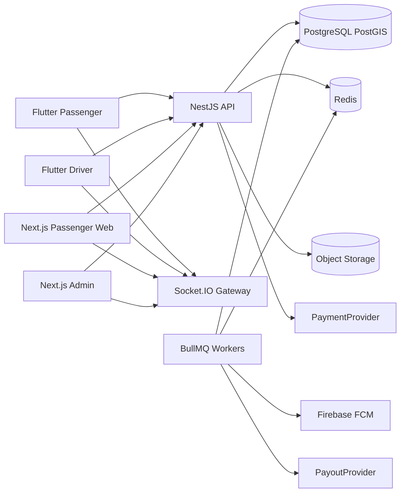
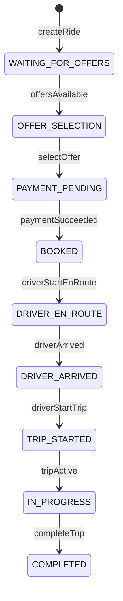

# CAN-GO — Complete Flutter Audit & Platform Plan (Revised)

## Locked product decisions

| Decision | Choice |
|----------|--------|
| Booking model | **Marketplace** (request → driver bids → passenger selects → pay) — not Uber auto-assign |
| Flutter UI | **Do not rebuild**; wire existing screens; no fake “done” features |
| Auth (Phase 1) | Email + password **and** **verified phone OTP** (not deferred) |
| Push (Phase 0/1) | Dedicated **CAN-GO Firebase** project + FCM for Passenger, Driver, Passenger Web |
| Documents (Phase 1) | Real private uploads + Admin KYC — not deferred |
| Ride lifecycle | Continues past BOOKED through trip execution + exceptional states |
| Live tracking | Production Socket.IO + Redis + PostGIS location architecture (Phase 1) |
| Pricing | **Server-authoritative** pricing/offer policy engine — never trust client prices |
| Payments | `PaymentProvider` / `PayoutProvider` abstractions; Dev locally; production provider behind interface |
| SMS / OTP | `SmsProvider` / `OtpProvider` abstractions; local mock; configurable production provider |
| Map pin / geo | **Phase 1:** real map pin pick + native current-location (not deferred) |
| Ratings | **Phase 1:** create + store; **Phase 2:** moderation |
| Launch gate | Production blocked until real Payment + Payout + SMS/OTP providers pass **staging E2E** |
| Service types | UI keeps all five tabs; Phase 1 backend = **RIDE + PER HOUR**; others “Coming soon” |
| Driver Web | **Not built** |
| Secrets | Never commit Firebase Admin / payment / DB credentials |

**Traceability rule (every production feature):**

`Client UI → API → Authorization → Business Logic → Database → Real-Time (if required) → Notification (if required) → Admin visibility/control (if required) → Audit/Logging`

---

## Audit verdict (source of truth — unchanged findings)

Both apps under [`mobile/apps/passenger`](mobile/apps/passenger) and [`mobile/apps/driver`](mobile/apps/driver) are **UI prototypes**.

| Layer | Reality |
|-------|---------|
| State | Provider + single `AppState` ChangeNotifier + go_router |
| Data | [`gt_mock`](mobile/packages/gt_mock) in-memory MockRepository |
| Persistence | SharedPreferences only |
| Auth / Pay / Push | None / fake card / none |
| Maps | Photon + OSM + OSRM |
| Backend / Admin / Web | Absent |

**Critical gaps already found:** booking payload drops most draft fields; map-pick Done hardcodes places; driver docs/photos are flags; activation is a demo toggle; lifecycle stops conceptually at `booked` in Flutter enum.

### Coverage report

| Metric | Count |
|--------|------:|
| Passenger `lib/` Dart scanned | 20 |
| Driver `lib/` Dart scanned | 28 |
| gt_mock / gt_ui Dart scanned | 5 / 8 |
| Screens / dialogs-sheets / actions / mocks | 17+16 / ~25 / ~170+ / ~55+ |

---

## Architecture overview



**Repo layout:** `backend/` · `apps/web-passenger/` · `apps/admin/` · keep `mobile/apps/*`

---

## 1. Firebase (Phase 0 / Phase 1) — locked

Create/configure a **dedicated CAN-GO Firebase project only**. Do not modify/delete unrelated Firebase projects.

### Apps / registrations

| Client | Firebase app | Purpose |
|--------|--------------|---------|
| Passenger Flutter (Android/iOS) | Native apps | FCM device tokens |
| Driver Flutter (Android/iOS) | Native apps | FCM device tokens |
| Passenger Web | Web app | FCM web push where applicable |

### Capabilities (must all be real)

- FCM setup + server key / Admin SDK credentials via **secrets manager / env** (never git)
- NestJS **firebase-admin** module
- Register / refresh / invalidate **Passenger** and **Driver** (and Web) device tokens
- Foreground, background, and **terminated-app** handling on Flutter clients
- **Deep links** from notification payload → go_router routes (ride detail, offer list, chat, KYC status, etc.)
- Delivery attempt logging (`notification_deliveries` table)
- Invalid / unregistered token cleanup on FCM error codes
- Admin visibility: notification history + template management (see Admin)

### Token model

`device_tokens(user_id, platform, app_role, token, last_seen_at, created_at)` unique on token; refresh replaces prior token for same device id.

---

## 2. Complete ride execution state machine — locked

Server-authoritative. Flutter `RideStatus` will be **mapped/extended** to these canonical states (clients display friendly labels; server is source of truth).

### Happy path



`TRIP_STARTED` and `IN_PROGRESS` may be collapsed to one persisted state if product prefers; both timestamps still recorded on the event log.

### Exceptional states

`PASSENGER_CANCELLED` · `DRIVER_CANCELLED` · `ADMIN_CANCELLED` · `NO_SHOW` · `PAYMENT_FAILED` · `EXPIRED`

### Transition rules (summary)

| From | To | Actor | Notes |
|------|-----|-------|-------|
| WAITING_FOR_OFFERS | OFFER_SELECTION | System | First valid offer or threshold policy |
| WAITING_FOR_OFFERS | EXPIRED | System | Request TTL |
| WAITING_FOR_OFFERS / OFFER_SELECTION | PASSENGER_CANCELLED | Passenger | Policy fees if any |
| OFFER_SELECTION | PAYMENT_PENDING | Passenger | Select offer; hold pricing snapshot |
| PAYMENT_PENDING | BOOKED | System/PaymentProvider | Verified webhook / Dev confirm |
| PAYMENT_PENDING | PAYMENT_FAILED | System | Idempotent fail |
| PAYMENT_PENDING | EXPIRED | System | Pay window timeout → release offer |
| BOOKED → … → COMPLETED | Driver (status) / System | Geofence optional assists; server validates |
| Active states | NO_SHOW | Driver/Admin | After wait policy |
| Active states | *_CANCELLED | Passenger/Driver/Admin | Role + fee rules |
| Any | ADMIN_CANCELLED | Admin | Audited intervention |

**Every transition** writes `ride_events(ride_id, from_status, to_status, actor_type, actor_id, payload_json, created_at)`.

Clients never invent status; they call transition endpoints; server rejects illegal transitions.

---

## 3. Live driver & trip tracking — locked (Phase 1)

### Pipeline

1. Driver app sends location updates (throttled, e.g. 3–5s moving / 15–30s idle) over authenticated Socket.IO (or HTTPS batch fallback).
2. NestJS validates driver owns active assignment; writes **latest** location to Redis (`driver:{id}:loc`) + PostGIS `driver_locations_current`.
3. Broadcast to rooms: `ride:{id}`, `admin:ops` (and passenger user room).
4. State-driven events: approaching pickup (distance threshold), arrived, trip started, active trip trail, completed.

### Retention / downsampling

| Store | Retention | Purpose |
|-------|-----------|---------|
| Redis current | TTL ~2–5 min | Live map |
| `driver_locations_current` | Upsert only | Last known + last_seen |
| `trip_location_samples` | Downsample ~every 15–30s or >50m move during active trip | Replay / disputes |
| Raw high-freq points | **Not** kept forever | Drop after downsample |

Connectivity: if no update beyond threshold → `driver.offline` / last_seen stale on Admin + passenger map.

### Consumers

- Flutter Passenger live map (extend existing map widgets — no UI rebuild)
- Passenger Web live map
- Admin Operations live map
- Deep-link notification taps open active ride map

---

## 4. Production Admin Portal — locked

Beyond KYC/CRUD. Next.js Admin with **fine-grained RBAC** + audit on every privileged action.

| Module | Purpose |
|--------|---------|
| Operational Dashboard | KPIs, active rides, failures |
| Live Operations Map | Drivers + active trips |
| Active Rides / Ride Detail Timeline | Status + `ride_events` + locations |
| Passenger Management | Accounts, suspend, GDPR |
| Driver Management | Profiles, approval, suspend |
| Driver KYC / Documents / Vehicles | Review, reject reason, re-upload |
| Operating Zones / Service Areas | View/policy; platform service areas |
| Manual Dispatch / Reassignment | When operationally required |
| Ride cancellation / intervention | Admin cancel + fees |
| Offers/Bids | Audit bids |
| Pricing / Fare Rules | Min fare, bid bounds, waiting |
| Platform Commission / Taxes / Fees | Config |
| Cancellation / No-show Rules | Config |
| Promo Codes | CRUD + usage |
| Payments / Refunds | Intents, captures, refunds |
| Driver Earnings / Payouts | Ledgers + PayoutProvider |
| Notifications / Templates | FCM/email templates + logs |
| Support / Chat oversight | Tickets; chat where lawful |
| Ratings / Reviews | Phase 1 list; Phase 2 moderation |
| CMS / FAQ / Legal | Content for apps/web |
| Reports / Exports | CSV/async exports |
| Admin Users / Roles & Permissions | RBAC |
| Audit Logs | Immutable admin actions |
| System Settings | Feature flags, TTLs |
| Integration / Webhook Logs | Payment etc. |
| Failed Jobs / Queues | BullMQ visibility |

---

## 5. Pricing engine — locked (server-authoritative)

NestJS `PricingModule` + persisted **price snapshots** on ride/offer/booking.

**Inputs:** currency, service type, vehicle category, estimated distance/duration (OSRM/haversine server-side), promo code, policy config.

**Outputs / ledger fields:**

- Minimum fare · suggested/guidance band (optional)
- Driver bid (validated against min/max bid policy)
- Waiting charges · cancellation charges
- Taxes · platform fees · platform commission
- Promo/discount
- **Final passenger amount** · **Driver earning** · **Platform earning**

**Rules:**

- Clients may *propose* a bid amount; server validates and stores authoritative totals.
- Never trust Flutter/Web calculated totals for charge/capture.
- Selecting an offer freezes a snapshot used for payment + earnings.

---

## 6. Authentication — locked (Phase 1 includes phone OTP)

| Capability | Requirement |
|------------|-------------|
| Register / Login | Email+password (Argon2) |
| Phone verification | OTP send/verify via `OtpProvider` + `SmsProvider`; **verified phone required for Phase 1 passenger & driver** |
| Password reset | Email or OTP-gated |
| Tokens | Short-lived access JWT + **rotating** refresh (DB) |
| Sessions | Device/session tracking; logout current / logout all |
| Suspension | Admin flag blocks auth |
| Driver approval | Separate from login: `pending_kyc` / `approved` / `rejected` / `suspended` |
| OTP | Expiry + rate limit + brute-force lockout |
| Admin | Stronger auth; **2FA-ready** (TOTP schema + enforce flag) |

**Provider abstractions (Phase 0 stubs / Phase 1 wiring):**

```typescript
interface SmsProvider {
  sendSms(toE164: string, body: string): Promise<{ providerMessageId: string }>;
}

interface OtpProvider {
  issue(phoneE164: string, purpose: OtpPurpose): Promise<{ challengeId: string; expiresAt: Date }>;
  verify(challengeId: string, code: string): Promise<{ ok: boolean }>;
}
```

- **MockSmsProvider** / **MockOtpProvider** for local (log code to console/Mailhog-style OTP inbox; never for production launch)
- Production SMS/OTP provider selected via env (`SMS_PROVIDER`, `OTP_PROVIDER`) — Twilio/MessageBird/etc. behind the same interfaces
- Subject to **production launch gate** (§ Launch gate)

Flutter: add auth gates without redesigning approved book/ride UI; secure token storage (`flutter_secure_storage`).

Passenger Web: **same User table** — no separate web identity DB.

---

## 7. Driver documents Phase 1 — locked

| Requirement | Detail |
|-------------|--------|
| Storage | Private bucket (MinIO local / S3 prod) |
| Types | Selfie, license, VRC/vehicle docs, vehicle photos (≤6), etc. |
| Validation | MIME + magic-byte + size limits |
| Metadata | type, vehicle_id, uploaded_at, expiry (where applicable) |
| Review | pending / approved / rejected + **rejection reason** |
| Re-upload | Allowed after reject |
| Access | Short-lived **signed URLs** only |
| Activation | Admin approve docs → server `activated` (replace demo toggle) |
| Audit | Upload, review, activation events |

Flutter Documents/Photos screens: real `image_picker` / file pick → upload API; keep existing layout.

---

## 8. Passenger Web full account parity — locked

Same NestJS backend + same passenger user.

| Area | Required |
|------|----------|
| Auth + phone verify | Yes |
| Book / offers / pay / history / account | Yes |
| Active booking + live tracking map | Yes |
| Cancellation + live status | Yes |
| Chat/contact where supported | Yes |
| Receipts | Yes |
| Ratings/reviews | Yes — **create/store Phase 1**; moderation Phase 2 |
| Saved locations | Yes |
| Saved payment **references** (tokens/customer ids — never PAN) | Yes |
| Notification history | Yes |

---

## 9. Security hardening — locked

- DTO/schema validation (class-validator / Zod)
- Ownership / IDOR checks on every ride/offer/doc
- RBAC + fine-grained Admin permissions
- Admin 2FA-ready
- Rate limiting; OTP abuse prevention
- Refresh-token reuse detection → revoke family
- Session/device revocation
- Secure headers / CSP; CORS allowlist
- Upload MIME + magic-byte + size limits
- Signed private document URLs
- Webhook signature verification + replay protection
- **Idempotency keys** for payments and critical ride ops
- Secrets management (env/vault; never in git)
- Dependency scanning
- Sanitized production errors
- Structured security logging
- DB backup + **restore testing**
- Immutable audit logs

---

## 10. Payment, payout & SMS/OTP abstraction — locked

```typescript
interface PaymentProvider {
  createIntent(input): Promise<PaymentIntentResult>;
  parseWebhook(headers, rawBody): Promise<VerifiedEvent>;
  refund(paymentId, amount?): Promise<RefundResult>;
}

interface PayoutProvider {
  ensureBeneficiary(driverId, prefs): Promise<BeneficiaryRef>;
  createPayout(batch): Promise<PayoutResult>;
  parseWebhook(...): Promise<VerifiedEvent>;
}

interface SmsProvider {
  sendSms(toE164: string, body: string): Promise<{ providerMessageId: string }>;
}

interface OtpProvider {
  issue(phoneE164: string, purpose: OtpPurpose): Promise<{ challengeId: string; expiresAt: Date }>;
  verify(challengeId: string, code: string): Promise<{ ok: boolean }>;
}
```

- **DevPaymentProvider** / **DevPayoutProvider** / **MockSmsProvider** / **MockOtpProvider** for local
- Production payment, payout, and SMS/OTP providers behind the same interfaces — **no hard coupling** to Stripe, Payoneer, or a single SMS vendor
- Webhooks idempotent + signature verified
- **Never store PAN/CVV**; only provider payment method references

### Production launch gate (hard stop)

Production deploy is **blocked** until all of the following pass on **staging**:

1. Real (non-Dev) **PaymentProvider** end-to-end (intent → webhook → BOOKED → capture/finalize)
2. Real (non-Dev) **PayoutProvider** end-to-end (earnings → payout batch → webhook)
3. Real (non-Mock) **SmsProvider** / **OtpProvider** end-to-end (send OTP → verify → authenticated session)
4. Full staging E2E suite (marketplace → trip → rating) green with those providers

Dev/Mock providers remain allowed for local and CI unit tests only.

---

## 11. Observability — locked

| Signal | Approach |
|--------|----------|
| Structured logs | pino/winston JSON with requestId, userId |
| Error tracking | Sentry (or equivalent) for API/workers/web |
| Health | `/health` (API), `/health/ready` (DB/Redis) |
| Queues | BullMQ board or metrics; failed job alerts |
| FCM failures | Logged + metrics; token cleanup |
| Auth abuse | Rate-limit counters + alerts |
| Admin actions | Audit log + searchable UI |
| Backups | Job success/fail monitors |
| Envs | `local` / `development` / `staging` / `production` isolated config |

---

## 12. Testing additions — locked

### Primary E2E (must pass before Phase 1 “done”)

Passenger register → phone verify → booking → driver receives request → driver offer → passenger select → payment → BOOKED → DRIVER_EN_ROUTE → DRIVER_ARRIVED → trip start → live tracking → COMPLETED → payment finalization → driver earning → passenger receipt → rating

### Additional cases

- KYC approve/reject + re-upload
- FCM foreground/background (and terminated where automatable)
- WebSocket reconnect
- Duplicate payment webhook; duplicate booking (idempotency)
- Expired offer; driver/passenger cancel; no-show
- Unauthorized ride access (IDOR)
- Admin permission boundaries
- Zone boundary matching
- GPS disconnect/reconnect
- Failed worker recovery

Also: unit tests for pricing + state machine transitions; PostGIS fixtures; Playwright Admin/Web; Flutter integration against staging.

---

## Data model extensions (beyond prior ERD)

Add/ensure: `RideEvent`, `DeviceToken`, `NotificationDelivery`, `NotificationTemplate`, `OtpChallenge`, `UserSession`, `DriverLocationCurrent`, `TripLocationSample`, `PriceSnapshot`, `FareRule`, `CommissionRule`, `TaxFeeRule`, `CancellationRule`, `SavedPlace`, `PaymentMethodRef`, `EarningsLedger`, `PayoutBatch`, `AdminPermission`, `AuditLog`, `WebhookEvent`, `IdempotencyKey`, document metadata + review fields.

Flutter enum mapping: keep UX labels; persist canonical server statuses listed in §2.

---

## REST / Socket.IO deltas (high level)

**Auth:** register, login, OTP send/verify, password reset, refresh, logout, logout-all, sessions  
**Rides:** create (full payload), list, get, cancel, select-offer, transition endpoints for driver trip states  
**Tracking:** WS `driver.location`, `ride.location`, `ride.status`  
**Docs:** multipart upload, status, admin review  
**Payments:** createIntent (server amounts), webhooks  
**Admin:** all modules above  
**Notifications:** register token, list history  

Rooms: `user:{id}`, `driver:{id}`, `ride:{id}`, `admin:ops`

Jobs: matching fan-out, offer TTL, pay expiry, FCM send, downsample locations, payouts, webhook retries

---

## Notification matrix (expanded)

| Event | Passenger | Driver | Admin |
|-------|-----------|--------|-------|
| OTP | SMS | SMS | — |
| New offers / bid updates | FCM + WS | — | Ops |
| New request in zone | — | FCM + WS | Ops |
| Payment success/fail | FCM | — | Logs |
| BOOKED / en route / arrived / started / completed | FCM + WS | FCM + WS | Live map |
| Cancel / no-show / expired | FCM + WS | FCM + WS | Yes |
| KYC review / activation | — | FCM | Queue |
| Chat | FCM | FCM | Oversight |
| Deep link | ride/offers/chat/kyc routes | same | — |

---

## Revised phased implementation

### Phase 0 — Foundations + Firebase

- Docker: PostGIS, Redis, MinIO, Mailhog, (OTP SMS mock)
- NestJS modular scaffold, Prisma + PostGIS, config per env
- Secrets pattern (`.env.example` only)
- Health + structured logging + error tracking hook
- **CAN-GO Firebase project** + Passenger/Driver/Web apps; Admin SDK; token API stubs; delivery log schema
- Observability baseline

### Phase 1 — Production core (no fakes for listed items)

1. **Identity:** email/password + phone OTP (`SmsProvider`/`OtpProvider`) + sessions + suspension + driver approval states  
2. **KYC:** real uploads, review, activation, zones  
3. **Marketplace:** pricing engine, matching, offers, PaymentProvider Dev, states through BOOKED  
4. **Execution:** full state machine, event log, live tracking, FCM + deep links  
5. **Maps (Phase 1 — not deferred):** real map **pin pick** (fix hardcoded Done) + **native current geolocation** on Passenger/Driver (web geolocation already partial)  
6. **Ratings (Phase 1):** create + persist after COMPLETED; receipt linkage  
7. **Clients:** wire Flutter (preserve UI); Passenger Web full parity; Admin Ops portal  
8. **E2E** suite above must pass (may use Dev/Mock providers on local/CI)

### Phase 2 — Providers & polish

- Wire configurable **production** PaymentProvider + PayoutProvider + Sms/Otp provider (still behind abstractions)  
- Chat hardening, promo/CMS/legal  
- **Ratings moderation** (create/store already in Phase 1)  
- Admin 2FA enforcement option  
- Staging E2E with **real** providers → satisfy **production launch gate**

### Phase 3 — Expansion

- DELIVERY / CAR RENTAL / EXPERIENCES  
- VIP, referrals, calendar day-off  
- Optional Google Maps provider swap  

**Constraint:** Refactor Flutter only for API, auth, FCM, uploads, payment sheet, live map binding, real pin/geo, ratings submit — **do not rebuild UI or remove existing functionality**.

---

## Local & production

**Local:** Compose services + Nest `:4000` (`.env` default; avoids XAMPP on 3000) + Admin `:3001` + Passenger Web `:3002` + Flutter `web-server` `:5050` (Cursor IDE browser only; never spawn Chrome). Mock SMS/OTP + Dev payment/payout.

**Staging:** Real PaymentProvider + PayoutProvider + SMS/OTP provider; full E2E green = unlock prod.

**Production:** Managed PostGIS/Redis/S3, Nest API+workers, Next apps, CAN-GO Firebase, **only after launch gate**; backups + restore drills, alerts.

---

## Screen matrices (audit — status target after Phase 1)

Passenger Book→Pay, Rides, Account, Support contact, **map pin + native geo**, **rating submit**; Driver onboard/docs/zones/offers/rides/chats + native geo; Web parity; Admin modules — all move from Mock/Local to **Backend Required → Fully Functional** with real API/WS/FCM/Admin. Stub service tabs remain Coming soon until Phase 3. Rating **moderation** UI remains Phase 2.

---

## Prior context

Extends [NestJS real platform](8d5bfce4-30ee-4aa4-b75b-271be2bb1db9) and the approved Flutter audit. Final corrections: Phase 1 map pin/native geo; Phase 1 rating create/store (moderation Phase 2); Sms/Otp provider abstraction; production launch gate.

---

## Execution status

- Plan contract: **approved** (including four final corrections).
- **Phase 0: complete** — NestJS foundations + CAN-GO Firebase project/apps + provider stubs + launch gate (Docker Desktop not installed on host; compose file ready). Admin SDK JSON still needs one-time manual download into `secrets/`.
- **Phase 1a: complete** — Auth module (register/login/OTP/refresh/sessions/password-reset/admin 2FA-ready), Argon2, JWT + rotating refresh, Prisma OTP, throttling.
- **Phase 1b: complete** — MinIO private storage + signed URLs, driver document upload/review/re-upload, admin activate/reject KYC, vehicles, operating zones + PostGIS `geom`. Flutter wire remains Phase 1e.
- **Phase 1c: complete** — FareRule pricing engine, rides/offers/zone matching, Dev payment intents → BOOKED, TTL sweeper. Docs: `backend/docs/phase-1c-marketplace.md`.
- **Phase 1d: complete** — Trip transitions through COMPLETED, Socket.IO + HTTP live tracking (Redis/PostGIS), FCM send + deep links, ratings create/store, map-pick Done uses real pin coords. Docs: `backend/docs/phase-1d-execution.md`.
- **Phase 1e: complete (MVP wire)** — Flutter Passenger/Driver use `gt_api` against Nest; demo driver activation removed; Passenger Web `:3002` + Admin Ops `:3001` scaffolds. FCM client register + Socket.IO map UI binding deferred to 1f polish / follow-ups. See `docs/phase-1e.md`.
- **Phase 1f: complete** — Pricing unit tests + live HTTP E2E (`npm run test:phase1f`) 14/14: primary book→trip→rating+earning, IDOR, idempotency, cancel, no-show, webhook dup, admin RBAC. Docs: `backend/docs/phase-1f-e2e.md`. FCM device delivery + Playwright UI remain Phase 2 / manual.
- **Phase 2: complete (adapters + polish)** — Stripe payment/payout + Twilio SMS selectable via env; ratings moderation; `ADMIN_TOTP_ENFORCE`; ride chat hardening; promo codes + CMS legal pages; launch-gate checklist. Staging E2E with **real** Stripe/Twilio keys still required for production unlock (`launch-gate` todo). Docs: `backend/docs/phase-2-providers.md`.
- **Launch gate: enforcement complete** — Production boot requires real providers + credentials + `STAGING_E2E_PASSED=true` + `ADMIN_TOTP_ENFORCE`; CI script `npm run launch-gate:check`. Ops must still run staging E2E with Stripe/Twilio and flip the sign-off flag. Docs: `docs/launch-gate.md`.
- **Phase 3: complete** — DELIVERY/CAR_RENTAL/EXPERIENCES pricing + rides; VIP request/admin; referrals; driver day-off filter on open requests; maps provider (`photon`/`google`); Flutter VIP/day-off/referral/book wire (UI kept). Docs: `docs/phase-3.md`, `backend/docs/phase-3-expansion.md`.
- **Next:** Staging E2E with real Stripe/Twilio → set `STAGING_E2E_PASSED` for production unlock; optional Flutter Google Maps client swap.
