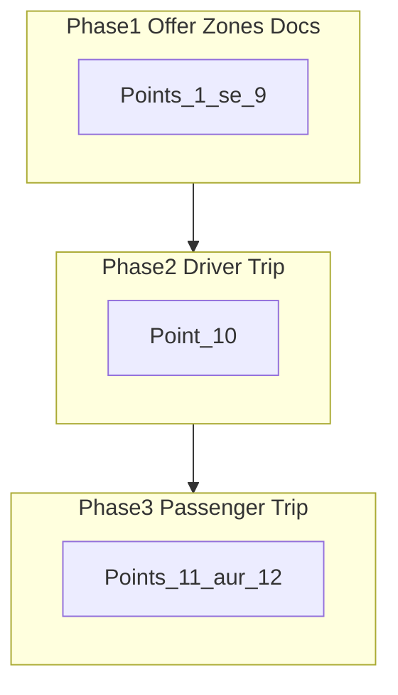

# Driver + Passenger — 12 Points Plan (Roman Urdu)

## Scope (pehle clear)

- **App:** Flutter Driver + Flutter Passenger
- **Backend:** jahan notification / delete / change-request missing ho
- **Web passenger:** is plan mein **nahi** (baad mein)
- **Kaam 3 phases** mein: pehle offer/zones/docs → phir driver trip → phir passenger trip

---

# PHASE 1 — Offer, documents, zones (Point 1 se 9)

---

## Point 1 — Driver jo chahe price offer kare (competitive bar hatao)

**Ab kya problem hai**
- Offer sheet / sticky panel pe **competitive guidance bar** dikhti hai (green → red meter: Competitive / Typical / Above).
- Driver ko feel hota hai ke usay “recommended range” follow karni hai.

**Kya change hoga**
1. `_GuidanceBar` poori tarah **remove** — sheet se bhi, sticky panel se bhi.
2. Driver **koi bhi price** enter kar sake (sirf basic validation: price > 0).
3. Soft tip text reh sakti hai: “lower price selection mein help karti hai / all-inclusive offer” — lekin **meter/bar nahi**.
4. File: [`your_offer_sheet.dart`](mobile/apps/driver/lib/offer/your_offer_sheet.dart), [`request_detail_screen.dart`](mobile/apps/driver/lib/screens/request_detail_screen.dart)

**Result:** Driver freely offer kare — koi competitive pressure UI nahi.

---

## Point 2 — “Your offer” popup band; sab fields same screen pe

**Ab kya problem hai**
- Request detail pe chhota sticky panel hai; **Edit** dabate hi bada **popup / bottom sheet** (`showYourOfferSheet`) khulta hai.
- Valid for, car, options, price, commission alag popup mein hain — mushkil lagta hai.

**Kya change hoga**
1. Popup / bottom sheet **band** — `showYourOfferSheet` use nahi hoga.
2. Request detail screen pe **seedha inline form** dikhega, same page pe scroll karke:
   - **Valid for** (kitni der offer valid)
   - **Car / vehicle** select
   - **Options** (wifi, charger, water, wheelchair, name sign, etc.)
   - **Price** field(s)
   - **Commission** display
   - **Send / Submit** button
3. Edit offer pe bhi wahi form pre-filled — dubara popup nahi.
4. Sticky mini panel ko expand / replace karke full form bana denge.

**Result:** Driver ek screen pe hi poori offer bana / edit kare — popup ki zaroorat nahi.

---

## Point 3 — Return trip ho to details + 2 prices (A→B aur B→A)

**Ab kya problem hai**
- Backend / sheet mein A→B aur B→A pehle se support hai, lekin popup ke andar hai.
- Return trip ki details (return time / return flight) clearly pehle incomplete thi — booking fixes se data aana shuru hua.

**Kya change hoga**
1. Agar passenger ne **return / round-trip** select kiya (`isRoundTrip = true`):
   - Request detail pe **return date/time** aur **return flight** clearly dikhao.
   - Price section mein **2 inputs**:
     - **Price A → B** (outbound)
     - **Price B → A** (return)
2. Agar one-way ho: sirf **ek** price field (A → B).
3. Submit pe dono prices backend ko `outboundPrice` / `returnPrice` ke through jayein (API pehle se ready).

**Result:** Round-trip pe driver do alag prices enter kare; return details bhi dikhein.

---

## Point 4 — Driver offer edit kare to passenger ko dubara notify + open screen refresh

**Ab kya problem hai**
- Driver edit (PATCH) pe backend **socket** `offer.updated` bhejta hai, lekin **push notification** create jaisi nahi.
- Agar passenger offer detail kholi hui hai, koi clear **popup** nahi ke “offer update ho gayi”.

**Kya change hoga**

**Backend**
1. `updateOffer` pe FCM push bhejo: title jaise **“Offer updated”** / **“Driver ne offer enhance ki”**.
2. Socket event pehle se hai — wohi rakho + strengthen.

**Passenger app**
1. Realtime pe `offer.updated` suno.
2. Notification / SnackBar: “Offer update hui”.
3. Agar usi offer ki **detail screen open** ho:
   - Dialog: **“This offer has been updated / enhanced”**
   - OK dabaye → screen **refresh** (nayi price / options load)
4. Offers list bhi auto refresh.

**Result:** Edit = passenger ko pata chale; open detail pe force refresh dialog.

---

## Point 5 — Driver offer withdraw kare to passenger se turant hat jaye + block

**Ab kya problem hai**
- Withdraw pe push jati hai, lekin passenger detail / list pe offer **kabhi kabhi reh jati hai**.
- Agar passenger us offer pe baitha ho, clear **block alert** nahi.

**Kya change hoga**

**Backend**
1. Withdraw pe passenger ko `marketplace.offer` event bhejo: `offer.withdrawn`.
2. Ride detail API se withdrawn offers list se **filter** (sirf ACTIVE / SELECTED).

**Passenger app**
1. List se offer **turant remove**.
2. Agar detail open ho us `offerId` ki:
   - Blocking dialog: **“This request/offer has been withdrawn by the driver”**
   - OK → **back** (offers list / rides)
3. Book button disabled / screen band — aage proceed na ho.

**Result:** Withdraw = passenger side se offer gayab + open screen pe alert + back.

---

## Point 6 — Passenger offer detail pe driver/vehicle ki full compact UI

**Ab kya problem hai**
- Offer detail pe kuch info hai (photo, class, rating), lekin **plate** hide hai, layout zyada scatter / kam clear.
- Driver ki vehicle details advanced compact layout mein nahi.

**Kya change hoga** (ek scroll, compact, easy)

1. **Upar:** vehicle photos + badi price + Book CTA
2. **Vehicle block:** make, model, year, class, color, seats, bags, **number plate**
3. **Amenities:** wifi / charger etc. chips
4. **Driver trust strip:** rating, completed rides, years, languages + reviews
5. Waiting time short line
6. Price breakdown (expand)
7. Extra bade cards / clutter nahi — dense, clear, readable

**File:** [`offer_detail_screen.dart`](mobile/apps/passenger/lib/screens/offer_detail_screen.dart)

**Result:** Passenger ko driver + gaari ki saari zaroori baatein ek nazar mein, advanced lekin simple UI.

---

## Point 7 — Driver documents: preview, delete, better UI

**Ab kya problem hai**
- Upload ke baad sirf “done” icon — **image preview nahi**.
- **Delete** UI / API practically nahi (sirf reupload API).
- Layout basic hai.

**Kya change hoga**

**UI**
1. Har document (Selfie, License, Vehicle registration) ke liye clear card:
   - Status (uploaded / pending / rejected)
   - **Thumbnail / Preview** (tap → full screen)
   - **Replace** button
   - **Delete** button
2. Vehicle photos grid: tap → preview, long-press / icon → delete
3. Layout advanced lekin seedha samajhne layak (3 clear slots + photo grid)

**Backend**
1. Naya: `DELETE /driver/documents/:id` (apna doc soft-delete; admin-approved lock pe refuse)
2. Preview: existing signed URL `GET /driver/documents/:id`

**Result:** Driver dekh sake, hata sake, dubara upload kare — clear KYC screen.

---

## Point 8 — Operating zone: Draw mode pe circle / radius na dikhe

**Ab kya problem hai**
- Zone screen default **Circle** select hota hai (theek).
- User **Draw** pe switch kare to bhi map pe **circle + radius** dikhta rehta hai — galat.

**Kya change hoga**
1. Tool = **Circle** → sirf tab circle draft + radius slider.
2. Tool = **Draw** → circle layer **hide**, radius UI **hide**, sirf freehand draw.
3. Tool switch pe purana circle draft clear.

**Files:** [`zone_screen.dart`](mobile/apps/driver/lib/screens/onboarding/zone_screen.dart), [`operating_zone_map.dart`](mobile/apps/driver/lib/screens/onboarding/zone/operating_zone_map.dart)

**Result:** Draw mode clean — koi circle ghost nahi.

---

## Point 9 — Driver ek saath multiple zones draw kare (ek tick pe save)

**Ab kya problem hai**
- Ab: draw → tick → save → phir dubara Add → draw → tick… har zone alag cycle.
- Multiple areas ek session mein soft nahi.

**Kya change hoga**
1. Draw mode mein session open rahe.
2. Driver jitne chahe polygons **ek ke baad ek** draw kare — har stroke draft list mein add.
3. **Ek baar Confirm / tick** → saari drafts save.
4. Delete: map pe zone **select** → Delete (wahi se hata de) — dubara poora flow nahi.
5. Circle mode: abhi jaisa single radius confirm (simple).

**Result:** Multiple draw → ek save; delete = select + delete.

---

# PHASE 2 — Driver scheduled rides full flow (Point 10)

---

## Point 10 — Schedule / booked rides: Start se Complete tak proper driver flow

**Ab kya problem hai**
- Rides tab pe list / calendar hai.
- Card tap pe **request/offer screen** khulti hai — trip ops nahi.
- Backend pe APIs **pehle se hain** (`en-route`, `arrived`, `start`, `complete`) — UI call nahi karti.

**Kya change hoga**

### Nayi screen: Trip Detail (`/trip/:rideId`)
Scheduled / booked ride open → yeh screen (offer screen nahi).

### Status ke hisaab se bada button (industry flow)

1. **BOOKED** → primary: **Go en route** (main ja raha hoon pickup pe)
   - Secondary: Chat, Navigate (maps), Call passenger
2. **EN_ROUTE** → primary: **Arrived at pickup**
3. **ARRIVED** → primary: **Start trip**
4. **TRIP / IN_PROGRESS** → primary: **Complete trip**
5. **COMPLETED** → summary (fare, time) — aur actions band

### Extra
- Screen pe **vertical timeline**: Confirmed → En route → Arrived → On trip → Done
- En route / on trip pe location tracking bhejo (`POST /tracking/location`)
- Round-trip ho to outbound + return details same trip pe dikhao
- Har action ke baad schedule refresh

**Result:** Driver ko proper transfer app jaisa flow — Start se Complete tak clear steps.

---

# PHASE 3 — Passenger notifications + booked ride UX (Point 11–12)

---

## Point 11 — Ride ongoing / complete pe passenger notify + help / rating / billing

**Ab kya problem hai**
- Backend status notify kar sakta hai; passenger app pe **proper UX nahi**.
- Rating API hai, **UI nahi**.
- Complete ke baad billing / help flow missing.

**Kya change hoga**

1. Jab ride **ongoing** ho (en route / arrived / started):
   - Passenger ko notification / in-app alert
   - Ride detail pe **“Help with this current ride”** (driver late, can’t find, wrong car, etc.)
2. Jab ride **complete** ho:
   - Notification: “Ride completed”
   - Auto **Rating** sheet (stars + short comment) → `POST /rides/:id/ratings`
   - Uske baad / saath: **Billing / receipt** summary (paid amount, fees)
   - CTA: **“Help with billing”** / I forgot something / dispute → support with ride id
3. Realtime `ride.status.changed` passenger app mein handle + optional navigate to ride

**Result:** Ongoing = help; Complete = rate + billing support — full post-trip experience.

---

## Point 12 — Passenger booked ride open kare to proper flow (chat, cancel, support, delay/reschedule)

**Ab kya problem hai**
- Booked ride open karne pe aksar **purani offer detail** (Book wala UI) khul jati hai — galat.
- Chat API backend pe hai, passenger UI nahi.
- Cancel / contact / refund / flight delay request proper nahi.

**Kya change hoga**

### Nayi screen: Booked Ride Detail
Rides list se booked/ongoing/past → **yeh screen** (offer book screen nahi).

### Screen pe kya dikhega
1. Status banner (Booked / Driver en route / Arrived / On trip / Completed / Cancelled)
2. Route A → B (+ return agar ho)
3. Driver + vehicle compact (photo, plate, class) — book hone ke baad
4. Actions (status ke mutabiq):
   - **Contact driver** (call if number available)
   - **Chat** (existing `/rides/:id/chat` wire — driver chat jaisa)
   - **Cancel booking** (confirm dialog → cancel API / transition)
   - **Support with this booking**
   - Ongoing: Help with current ride
   - Complete: Help with billing / Request refund (refund self-serve nahi — support case → admin)
5. **Flight delay / Reschedule request**
   - Form: type (Flight delay / Reschedule), new time, note, flight number
   - Backend naya endpoint: `POST /rides/:id/change-requests`
   - Driver + ops ko notify
   - Passenger ko “Request sent” confirmation
6. Driver trip screen pe pending change-request **banner** (minimum) — accept/decline baad mein enhance

**Result:** Passenger ko real booking management — contact, chat, cancel, support, delay/reschedule — professional flow.

---

# Files — short map

| Point | Main files |
|-------|------------|
| 1–3 | `request_detail_screen.dart`, `your_offer_sheet.dart` |
| 4–5 | `marketplace.service.ts`, passenger `app_state.dart`, `offer_detail_screen.dart` |
| 6 | `offer_detail_screen.dart` |
| 7 | `documents_screen.dart`, `photos_screen.dart`, `drivers.controller.ts` |
| 8–9 | `zone_screen.dart`, `operating_zone_map.dart` |
| 10 | naya `trip_detail_screen.dart`, `rides_screen.dart`, driver `app_state.dart` |
| 11–12 | naya `ride_detail_screen.dart`, chat client, rating UI, change-request API |

---

# Test checklist (Roman Urdu)

1. Driver koi bhi price daal sake — competitive bar gayab.
2. Offer form popup ke baghair same screen pe — valid for, car, options, price, commission.
3. Return trip pe 2 prices + return details.
4. Edit offer → passenger notification + open detail pe update dialog → refresh.
5. Withdraw → list se hat jaye; open detail pe alert → OK → back.
6. Offer detail pe vehicle/driver compact full info (plate included).
7. Documents preview + delete + clean UI.
8. Draw mode pe circle/radius nahi.
9. Multiple polygons draw → ek tick save; select → delete.
10. Driver BOOKED → En route → Arrived → Start → Complete.
11. Passenger ko ongoing/complete notify; complete pe rating + billing help.
12. Booked ride pe chat, cancel, support, flight delay / reschedule request.

---

# Order of work

1. **Phase 1:** Point 1–9 (driver offer UX + zones + docs + passenger offer realtime/UI)
2. **Phase 2:** Point 10 (driver trip ops)
3. **Phase 3:** Point 11–12 (passenger trip + support)

Jab aap **“implement / execute / start”** kahen, tab coding shuru hogi — abhi sirf plan detail hai.
