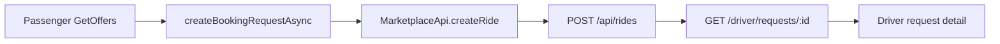

# Passenger booking fixes (Flutter + driver pipeline)

Scope: **Flutter passenger app** ([`mobile/apps/passenger`](mobile/apps/passenger)), plus **backend + Flutter driver** so submitted details actually reach drivers. Web passenger gets the same adults/child-seat label fixes for consistency (small surface).

## 1. Block Get offers until terms accepted

In [`book_screen.dart`](mobile/apps/passenger/lib/screens/book_screen.dart) `GtGreenButton.onPressed` (~163–204), add a check before auth/booking:

- If `!state.termsAccepted` → SnackBar: accept terms of service; return.
- Keep `_TermsToggle` as-is (`SwitchListTile` bound to `AppState.termsAccepted`).

Mirror on web if touching web: already validated in [`booking-page.tsx`](apps/web-passenger/components/booking-page.tsx); optional: disable CTA when unchecked.

## 2. Fully remove Car rental & Experiences (no leftovers)

Purge **everything** related to these modes from the Flutter passenger app — not just hide chips. Nothing car-rental / experiences related should remain in UI or client logic.

In [`book_screen.dart`](mobile/apps/passenger/lib/screens/book_screen.dart):

- Remove `carRental` / `experiences` from `_ServiceChips` items list.
- Delete the entire Experiences / Car rental `else` branch (promo card, copy, map, terms branch for those modes).
- Remove Get-offers special-cases that inject mock places or use `open_in_new` for those service types.
- Remove the comment chip `"I'm interested in renting a car at a good price"` from `_CommentBlock`.

In [`app_state.dart`](mobile/apps/passenger/lib/state/app_state.dart):

- Remove `carRental` and `experiences` from `ServiceType` enum.
- Remove `'CAR_RENTAL'` / `'EXPERIENCES'` mapping in `createBookingRequestAsync`.
- Remove car-rental-only `days` / quote paths tied to that service type.

No new screens, stubs, feature flags, or “coming soon” placeholders. Backend `CAR_RENTAL` / `EXPERIENCES` service-type values can stay unused in the API (no DB migration needed); they will simply never be sent from the passenger app.

## 3. Show “from” price under vehicles after A & B — RIDE tab only

**Scope: RIDE only.** Do not change PER HOUR or DELIVERY.

- PER HOUR already shows from-prices (`showFromPrice: true`) — leave as-is.
- DELIVERY — no change.
- RIDE today uses `_VehicleClassRow(..., showFromPrice: false)`.

For RIDE only:

- Pass `showFromPrice: state.from != null && state.to != null` (both A and B selected).
- Until A and B are set, hide from-prices under vehicle cards.
- Reuse existing price rendering (strip `"from "` prefix, muted `from` + green amount) already in `_VehicleClassRow` (~506–597).

## 4. Get offers ke baad driver ko passenger ki saari details dikhein

**Goal (seedha):** Passenger jo bhi form mein bhar ke **Get offers** dabaye, wohi details **driver app** ki request detail pe dikhein.

**Haan — is ke liye driver side pe bhi fixes hain** (sirf passenger form nahi). Teen jagah kaam:

1. Passenger app → Get offers pe **saara data bhejo** (ab kuch fields fill hoti hain lekin server tak nahi jaati)
2. Backend → jo missing field hai (`returnFlight`) **save** karo
3. Driver app → jo pehle hide tha (flight number, name-sign text) **dikhao**

### Driver ko yeh dikhega (after fix)

- Location A aur B (+ map)
- Kaunsi vehicles select hui
- Date / pickup time
- Arrival flight number
- Name on sign board (asli text, sirf “name sign” flag nahi)
- Add a return (round trip) + return time
- Return flight number
- Adults qty
- Child seats (infant carrier / convertible / booster counts)
- Comments

### Ab problem kya hai (kyun nahi dikhta)

- **Child seats, return trip, return flight** — passenger fill karta hai, lekin Get offers pe server ko **bheje hi nahi jaate** → driver tak pahunchte hi nahi
- **Flight number aur name on sign** — server pe save ho jaate hain, lekin **driver screen pe text/number hide** hai (sirf wait chip / “Meeting with a name sign”)
- Map, adults, vehicles, comment — pehle se zyada tar theek hain; unhe verify karenge ke payload complete hone ke baad sahi dikhein

### Pipeline changes

1. **API client** [`marketplace_api.dart`](mobile/packages/gt_api/lib/src/marketplace_api.dart): add `childSeatsJson`, `isRoundTrip`, `returnAt`, `returnFlight` to `createRide` body.
2. **AppState** [`app_state.dart`](mobile/apps/passenger/lib/state/app_state.dart) `createBookingRequestAsync`: pass child seats JSON, round-trip + return time, return flight.
3. **Backend** [`marketplace.dto.ts`](backend/src/marketplace/dto/marketplace.dto.ts) + Prisma `Ride`: add optional `returnFlight`; persist + include in driver payload.
4. **Driver detail** [`request_detail_screen.dart`](mobile/apps/driver/lib/screens/request_detail_screen.dart):
   - Show arrival **flight number**
   - Show **name on sign text** (e.g. `Name sign: Ahmed`)
   - Show **return flight** when present
   - Child-seat chips with new labels
5. **Models/parse**: `returnFlight` + child seat keys (`infant` / `convertible` / `booster`; legacy `child` as alias).

## 5. Adults default = 1

- Flutter: `int adults = 2` → `1` in [`app_state.dart`](mobile/apps/passenger/lib/state/app_state.dart).
- Web: `useState(2)` → `useState(1)` in [`booking-page.tsx`](apps/web-passenger/components/booking-page.tsx).

## 6–7. Child seats: proper display + correct types

Update shared model [`ChildSeats`](mobile/packages/gt_mock/lib/src/models.dart) (and web [`types.ts`](apps/web-passenger/lib/types.ts)):

- Rename field `child` → `convertible` (keep JSON key `convertible`; accept legacy `child` when parsing).
- Labels in sheet/modal:
  - **Infant carrier** — up to 10 kg, 6 months
  - **Convertible seat** — 9–25 kg, 0–7 years
  - **Booster seat** — 22–36 kg, 6–12 years

**Summary row display** (replace bare `Children (N)`):

- If total == 0: `Child seats`
- Else show compact breakdown, e.g. `Infant carrier ×1 · Convertible ×1` (or chips), not only `Children (1)`.

Same UX in Flutter `_ChildrenRow` / sheet and web children row + modal. Include `childSeatsJson` in web `submitWith` POST body so web bookings also reach drivers.

## Files to touch (primary)

- [`mobile/apps/passenger/lib/screens/book_screen.dart`](mobile/apps/passenger/lib/screens/book_screen.dart)
- [`mobile/apps/passenger/lib/state/app_state.dart`](mobile/apps/passenger/lib/state/app_state.dart)
- [`mobile/packages/gt_mock/lib/src/models.dart`](mobile/packages/gt_mock/lib/src/models.dart)
- [`mobile/packages/gt_api/lib/src/marketplace_api.dart`](mobile/packages/gt_api/lib/src/marketplace_api.dart)
- [`mobile/packages/gt_api/lib/src/status_map.dart`](mobile/packages/gt_api/lib/src/status_map.dart)
- [`mobile/apps/driver/lib/screens/request_detail_screen.dart`](mobile/apps/driver/lib/screens/request_detail_screen.dart)
- [`backend/src/marketplace/dto/marketplace.dto.ts`](backend/src/marketplace/dto/marketplace.dto.ts)
- [`backend/src/marketplace/marketplace.service.ts`](backend/src/marketplace/marketplace.service.ts)
- [`backend/prisma/schema.prisma`](backend/prisma/schema.prisma) (+ migration for `returnFlight`)
- [`apps/web-passenger/components/booking-page.tsx`](apps/web-passenger/components/booking-page.tsx) + types

## Verification

- Terms off → Get offers blocked; terms on → booking proceeds.
- No Car rental / Experiences chips, screens, comment chips, or client enum/mapping left — only RIDE / PER HOUR / DELIVERY.
- RIDE only: no from-price until A+B set; then green from-prices under vehicles. PER HOUR / DELIVERY unchanged.
- Adults stepper starts at 1.
- Child sheet shows three labeled types with weight/age; row shows breakdown.
- After Get offers, driver request detail shows A/B, vehicles, date, flight, name-sign text, return + return flight, adults, child seats, comments, map.