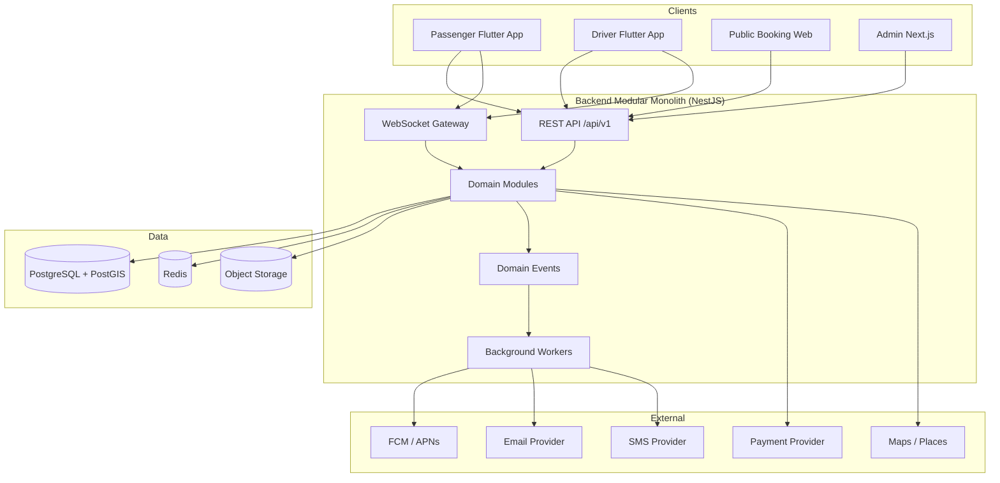

# 00 — Executive Summary

## Product Summary

**TransferMarket** is a multi-country **private transfer marketplace**. Passengers (or web bookers) publish a transportation request; eligible drivers/carriers submit **priced offers** with vehicle details and photos; the passenger compares offers and selects one; payment confirms the booking; the platform manages the lifecycle through trip completion, ratings, payouts, support, and disputes.

Unlike classic ride-hailing (instant dispatch + opaque surge pricing), the primary model is **tender / bidding**:

1. Passenger creates a request (transfer, airport, hourly chauffeur, long-distance, optionally delivery).
2. Eligible drivers receive the request in a feed.
3. Drivers bid with fare, vehicle, conditions, and extras.
4. Passenger compares and accepts an offer.
5. Payment authorization/capture confirms the booking.
6. Driver executes the trip under a controlled status machine.
7. Platform takes configurable commission; driver wallet accrues earnings; payouts settle later.

The platform is an **intermediary booking marketplace**, not a fleet operator. Transport is provided by independent drivers/carriers subject to local regulation and platform verification.

**CONFIRMED (reference):** GetTransfer markets itself as a worldwide marketplace connecting passengers and drivers for private transfers, long-distance trips, hourly chauffeur, and delivery; offers include vehicle photos, ratings, and completed rides before payment; drivers set their own prices.  
**ASSUMPTION / RECOMMENDED:** TransferMarket improves payout transparency, cancellation clarity, dispute tracking, safety, and admin oversight relative to common marketplace pain points.

---

## Recommended Architecture

| Layer | Recommendation | Rationale |
|-------|----------------|-----------|
| Mobile | **Flutter** — two apps (Passenger, Driver) + shared packages | One team, dual stores, shared design system/maps/chat clients |
| Backend | **NestJS (TypeScript) modular monolith** | Strong real-time (WebSockets), marketplace domain modeling, jobs, hiring pool; Laravel is viable but NestJS preferred for WS-heavy marketplace |
| Admin | **Next.js** admin portal | Flexible ops UX; Filament only if Laravel chosen |
| Public web | **Next.js** booking portal (shared design tokens with admin) | SEO + desktop bookers |
| DB | **PostgreSQL + PostGIS** | Geospatial eligibility, zones, radius |
| Cache / queue | **Redis** (+ BullMQ or equivalent) | Sessions, rate limits, jobs |
| Real-time | **WebSockets** (NestJS gateway) | Live location, offers, trip events |
| Storage | **S3-compatible** | Vehicle photos, KYC docs (private), chat media |
| Maps | **Google Maps** MVP (evaluate Mapbox later) | Places + directions maturity |
| Payments | **Stripe** primary (provider-agnostic adapter) | Tokenization, Connect-style payouts path |
| Notifications | **FCM + APNs**, transactional email, SMS for OTP/critical | Multi-channel |

**Architecture style:** Modular monolith + event-driven side effects. No microservices at launch. Clear module boundaries allow future extraction (Matching, Location, Notification, Payment, Chat, Analytics).

---

## MVP Scope (must ship)

- Auth (phone OTP + email), passenger request creation (one-way + airport + return basics)
- Driver onboarding + document upload + admin approval
- Vehicle management + admin vehicle approval
- Request feed + offer submission + offer comparison + accept
- Card payment (authorize/capture) + basic refunds
- Booking list + trip status machine (simplified live tracking)
- Push + email notifications for core events
- Admin: users, drivers, vehicles, bookings, basic finance views
- Configurable commission + cancellation policy (country-level)
- Ratings after completion
- i18n foundation (English first)

**Explicitly out of MVP:** courier delivery, advanced flight tracking automation, masked telephony, complex promotions, multi-stop heavy UX, driver→passenger ratings (optional), full dispute suite (basic ticket OK), multi-PSP.

Details: [22-mvp-roadmap.md](./22-mvp-roadmap.md).

---

## Architecture Diagram

---

## Module Matrix

| Module | Passenger | Driver | Admin | Backend | Priority | Complexity |
|--------|:---------:|:------:|:-----:|:-------:|:--------:|:----------:|
| Authentication | ✓ | ✓ | ✓ | ✓ | MVP | M |
| Profiles / KYC | ✓ | ✓ | ✓ | ✓ | MVP | L |
| Vehicles | — | ✓ | ✓ | ✓ | MVP | M |
| Locations / Maps | ✓ | ✓ | ✓ | ✓ | MVP | L |
| Ride Requests | ✓ | ✓ | ✓ | ✓ | MVP | L |
| Matching / Eligibility | — | ✓ | ✓ | ✓ | MVP | L |
| Bidding / Offers | ✓ | ✓ | ✓ | ✓ | MVP | XL |
| Bookings | ✓ | ✓ | ✓ | ✓ | MVP | L |
| Payments | ✓ | — | ✓ | ✓ | MVP | XL |
| Wallet / Payouts | — | ✓ | ✓ | ✓ | MVP (basic) | L |
| Live Trip / GPS | ✓ | ✓ | ✓ | ✓ | MVP (basic) | L |
| Chat | ✓ | ✓ | ✓ | ✓ | Phase 2 | M |
| Notifications | ✓ | ✓ | ✓ | ✓ | MVP | M |
| Support / Disputes | ✓ | ✓ | ✓ | ✓ | Phase 2 | L |
| Promotions | ✓ | — | ✓ | ✓ | Phase 2 | M |
| Analytics | — | — | ✓ | ✓ | Phase 2 | M |
| Multi-country config | ✓ | ✓ | ✓ | ✓ | MVP (scaffold) | L |
| DevOps / Observability | — | — | — | ✓ | MVP | M |

---

## Screen Count (estimate)

| Application | Unique screens (MVP) | Unique screens (full) |
|-------------|----------------------|------------------------|
| Passenger App | ~45–55 | ~70–85 |
| Driver App | ~40–50 | ~65–80 |
| Admin Portal | ~35–45 pages | ~60–80 pages |
| Public Website | ~12–18 | ~25–35 |

Exact inventory: [18-ui-screen-inventory.md](./18-ui-screen-inventory.md).

---

## API Domain Count

| Domain | Path prefix |
|--------|-------------|
| Auth | `/api/v1/auth` |
| Passenger | `/api/v1/passenger` |
| Driver | `/api/v1/driver` |
| Requests | `/api/v1/requests` |
| Offers | `/api/v1/offers` |
| Bookings | `/api/v1/bookings` |
| Trips | `/api/v1/trips` |
| Payments | `/api/v1/payments` |
| Wallet | `/api/v1/wallet` |
| Chat | `/api/v1/chat` |
| Notifications | `/api/v1/notifications` |
| Support | `/api/v1/support` |
| Locations / Geo | `/api/v1/locations` |
| Catalog (vehicles, countries) | `/api/v1/catalog` |
| Admin | `/api/v1/admin/*` |
| Webhooks | `/api/v1/webhooks/*` |

**~16 API domains** (admin may subdivide further).

---

## Development Sequence

1. **Phase 0** — Product definition, ERD, APIs, wireframes (this docs set)
2. **Phase 1** — Foundation: auth, users, drivers, vehicles, locations, admin base
3. **Phase 2** — Marketplace: requests, matching, offers, comparison
4. **Phase 3** — Booking confirmation + notifications
5. **Phase 4** — Payments, refunds, commission, wallet, payouts
6. **Phase 5** — Live trips, GPS, WebSockets, chat
7. **Phase 6** — Ops: disputes, support, promos, analytics
8. **Phase 7** — Hardening, store release

See [23-development-phases.md](./23-development-phases.md).

---

## Critical Risks

| Category | Risk | Mitigation |
|----------|------|------------|
| Marketplace | Cold start — few drivers → few offers | Seed cities, invite carriers, waitlist, recommended price tools |
| Marketplace | Bid spam / predatory pricing | Rate limits, min/max rules, reputation, admin review |
| Financial | Payment/webhook races; double booking | Idempotency keys, DB constraints, transactional state machines |
| Financial | Payout failures / driver distrust | Transparent ledger, reconciliation tools, clear statuses |
| Operational | Regulatory variance by country | Configurable KYC, vehicle rules, tax, payment methods per country |
| Technical | Live GPS at scale | Throttle location writes, Redis fan-out, PostGIS for eligibility only |
| Safety | Trust & safety incidents | Verified drivers, trip sharing (phase 2), SOS, audit trails |
| Legal | Platform liability as “carrier” | Clear terms: intermediary model; local counsel review |
| Product | Offer wait time vs instant-taxi expectations | UX education, ETA for first offer, urgent mode where viable |

---

## Open Questions (need business-owner approval)

1. Legal entity model and countries for launch (single country MVP vs multi)?
2. Commission default % and whether passenger fee vs driver fee (or both)?
3. Cash payments in MVP?
4. Who owns cancellation policy — platform-global vs per-offer?
5. Driver payout cadence (weekly / on-demand / threshold)?
6. Masked phone calling in MVP or Phase 2?
7. Courier/delivery in MVP?
8. Brand name, stores accounts, and payment merchant of record?

Full list: [24-assumptions-open-questions.md](./24-assumptions-open-questions.md).

---

## Product Improvements vs Reference (summary)

| Reference behavior (public / inferred) | Problem | Our improvement |
|----------------------------------------|---------|-----------------|
| Drivers set prices; platform mediates | Payout opacity reported in market feedback | Driver ledger with pending/available, fee breakdown, payout timeline |
| Offers before pay with photos/ratings | Comparison can be noisy | Sort/filter: price, rating, vehicle, response speed; clear total with fees/tax |
| Free waiting tiers by location type | Rules may be unclear in-app | Show waiting policy on offer + booking detail |
| Low urgent-ride commission (public interview 5%) | Dynamic commission opaque | Configurable rules + driver-visible commission preview before bid |
| Cash in some countries (App Store notes) | Operational risk | Country-flagged cash; reconciliation workflows |
| Support via contact if driver unreachable | Slow resolution | Booking-linked tickets, SLA, dispute evidence pack |

---

## Effort sizing (module-level, not calendar dates)

| Module | Size |
|--------|------|
| Passenger App | XL |
| Driver App | XL |
| Admin Portal | L |
| Authentication | M |
| Marketplace + Bidding | XL |
| Matching | L |
| Payments + Wallet + Payouts | XL |
| Maps + Live Tracking | L |
| Chat + Notifications | M–L |
| Support / Analytics / DevOps | M–L each |

**S/M/L/XL** definitions and dependencies: [23-development-phases.md](./23-development-phases.md).
