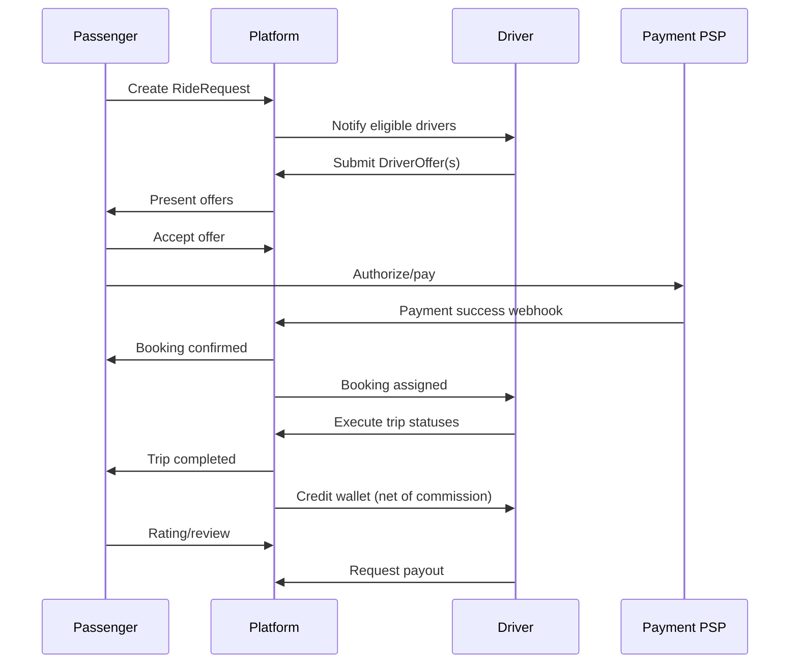

# 02 — Business Model

## 1. Positioning

**TransferMarket** is a two-sided marketplace for **private ground transportation**.

| Side | Who | Value |
|------|-----|-------|
| Demand | Passengers, travelers, SMEs booking transfers | Competitive fixed offers, vehicle transparency, global coverage |
| Supply | Independent drivers and carrier companies | Demand access, schedule-friendly advance bookings, pricing control |
| Platform | TransferMarket operator | Matching infrastructure, payments, trust & safety, support |

**Legal posture (ASSUMPTION / RECOMMENDED):** Platform is a technology intermediary facilitating bookings; carriers provide transport under local law. Confirm with counsel per launch country.

---

## 2. Confirmed reference economics (public)

| Item | Status |
|------|--------|
| Drivers set offer prices | **CONFIRMED** |
| Passenger pays after selecting an offer | **CONFIRMED** (before/at confirmation) |
| Price intended to include waiting (by location type), fuel, tolls | **CONFIRMED** (FAQ) |
| Commission exists; public claim of 5% on urgent rides | **CONFIRMED as public claim** |
| Cash available in some countries | **CONFIRMED** (App Store notes) |

Exact TransferMarket fees are **business decisions**, not copied.

---

## 3. Revenue streams

### Primary — Platform commission

```text
Passenger total paid
  − payment processing costs (or passed through)
  − taxes (jurisdiction-dependent)
  − platform commission / service fee
  ± adjustments / tips / penalties
  = driver earnings credited to wallet
```

**ASSUMPTION / RECOMMENDED:** Configurable commission rules by:

- Country / city / zone
- Service type (transfer, hourly, urgent, delivery)
- Vehicle class
- Driver segment / promotion
- Time-based campaigns

Do **not** hard-code percentages.

### Secondary (Phase 2+)

| Stream | Notes |
|--------|-------|
| Passenger service fee | Optional line item for transparency |
| Featured / “Top Selection” placement | Risk: must stay fair; disclosure required |
| Corporate accounts / API partners | B2B contracts |
| Cancellation / no-show fees (shared or platform-retained) | Policy-driven |
| Priority support subscriptions | Optional |

---

## 4. Marketplace lifecycle (business view)



Detailed technical workflow: [06-booking-marketplace-workflow.md](./06-booking-marketplace-workflow.md).

---

## 5. Service catalog

| Service | Description | MVP? |
|---------|-------------|------|
| One-way transfer | A → B at scheduled time | Yes |
| Return transfer | Outbound + return as linked requests or package | Yes (basic) |
| Airport transfer | Flight fields, meet & greet, waiting policy | Yes |
| Hourly chauffeur | Time-based booking | Phase 2 preferred; MVP optional |
| Long-distance / intercity | City-to-city | Yes (as transfer with distance) |
| Urgent / immediate | Shorter TTL, online drivers, live location | Phase 2 or limited MVP |
| Delivery / courier | Package fields | Phase 2+ |

---

## 6. Pricing philosophy

| Principle | Detail |
|-----------|--------|
| Driver-priced offers | Drivers propose fare |
| Fixed quote at acceptance | Price locked for agreed itinerary |
| Transparent totals | Show base, fees, tax, total before pay |
| Change management | Material itinerary changes may require re-quote / amendment flow |
| Recommended price | Platform may show **suggestion** based on distance/class/history — not a hard tariff |

**ASSUMPTION / RECOMMENDED:** Recommended price is advisory for drivers and optional “budget hint” for passengers; never presented as a guaranteed platform tariff unless a fixed-price mode is explicitly enabled later.

---

## 7. Trust & quality

| Mechanism | Purpose |
|-----------|---------|
| Driver KYC + vehicle verification | Supply quality / regulatory |
| Real vehicle photos | Reduce bait-and-switch |
| Ratings tied to completed bookings | Credibility |
| Review moderation | Abuse control |
| Self-dealing prevention | Block passenger↔same driver account abuse (**CONFIRMED** concern in reference KYC) |
| Insurance / licence validity tracking | Expiry jobs |

---

## 8. Unit economics (conceptual)

Track per booking:

| Metric | Definition |
|--------|------------|
| GMV | Gross merchandise value (passenger total) |
| Take rate | Platform revenue / GMV |
| Net revenue | Fees − payment costs − refunds − chargebacks |
| CAC | Cost to acquire passenger or driver |
| Contribution margin | Net revenue − variable support/fraud costs |
| Driver utilization | Booked hours / available hours |

Analytics detail: [21-analytics-reporting.md](./21-analytics-reporting.md).

---

## 9. Geographic expansion model

Launch **city/country by country**:

1. Enable country config (currency, tax, payment methods, KYC docs).
2. Seed driver supply (ops + partnerships).
3. Soft-launch passenger demand (airports first often).
4. Monitor offer density (offers per request) and cancellation rates.
5. Expand zones.

Cold-start risk is the #1 marketplace risk — see executive summary.

---

## 10. Roles in the value chain

| Role | Business responsibility |
|------|-------------------------|
| Passenger | Accurate request, payment, show-up |
| Driver/Carrier | Legal operation, vehicle standards, fulfill booking |
| Platform | Marketplace integrity, payments, support, policy enforcement |
| Payment provider | Card processing, disputes/chargebacks tooling |
| Ops / Support | Exception handling, KYC, disputes |

RBAC: [15-roles-permissions.md](./15-roles-permissions.md).

---

## 11. Cancellation & refund (business principles)

**ASSUMPTION / RECOMMENDED** policy engine dimensions:

- Time before pickup
- Who cancels (passenger / driver / admin / force majeure / flight)
- Whether payment was captured
- Waiting/no-show rules
- Country overrides

Reference FAQ confirms waiting tiers; exact refund matrices vary and must be configured by TransferMarket legal/product — not copied blindly.

---

## 12. Competitive differentiation (ours)

1. Clear fee and payout ledger for drivers  
2. Offer comparison UX with totals, policies, and sorting  
3. Ops-grade admin (timeline, audit, disputes)  
4. Strong state machines (no ambiguous booking states)  
5. Safety features roadmap (trip share, SOS, masked calling)  
6. Configurable multi-country from day one  

---

## 13. Success metrics (north stars)

| Stage | Metric |
|-------|--------|
| Liquidity | % requests with ≥1 offer within SLA; median offers per request |
| Conversion | Request → booking; offer → accept |
| Reliability | Completion rate; driver/passenger cancellation rate |
| Quality | Avg rating; complaint rate |
| Finance | Take rate; refund rate; payout success rate |
| Retention | 30-day passenger / driver repeat activity |
