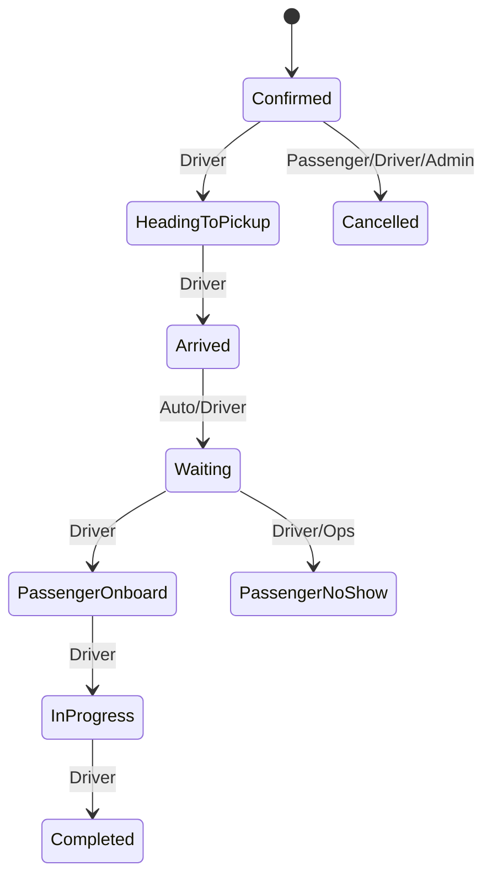

# 06 — Booking Marketplace Workflow

## 1. Overview

End-to-end lifecycle from request to completion. Primary model: **tender marketplace** (**CONFIRMED** for reference). Auto-assign nearest driver is optional future mode only.

```mermaid
flowchart LR
  A[Passenger creates request] --> B[Eligibility matching]
  B --> C[Drivers notified]
  C --> D[Drivers submit offers]
  D --> E[Passenger compares]
  E --> F[Select offer]
  F --> G[Payment]
  G --> H[Booking confirmed]
  H --> I[Trip lifecycle]
  I --> J[Completion]
  J --> K[Wallet credit + review]
```

---

## 2. Actors

Passenger, Driver, Platform (automation), Payment PSP, Admin/Ops, Support.

---

## 3. Phase A — Request creation

1. Passenger authenticates.  
2. Builds request (service type, places, time, pax, luggage, options).  
3. Client validates locally; **server re-validates**.  
4. Persist `RideRequest` (`status=open`).  
5. Emit `RideRequestCreated`.  
6. Matching job computes eligible drivers → `DriverEligibleForRequest`.  
7. Push/email to eligible drivers.  
8. Passenger enters waiting UI.

### Validation (server)

- Coordinates in allowed countries/zones  
- Datetime not in past (except urgent window)  
- Passenger count ≥ 1  
- Return/hourly constraints  
- Rate limit requests per user  

Entity fields: see [10-database-schema.md](./10-database-schema.md) `ride_requests`.

---

## 4. Phase B — Offer collection

1. Driver opens request (PII minimized).  
2. Selects approved vehicle; enters price + conditions.  
3. Server validates eligibility still true + price rules.  
4. Create `DriverOffer` (`pending`).  
5. Emit `DriverOfferSubmitted`.  
6. Notify passenger.  
7. Passenger may wait for more offers until request expires or accepts.

### Parallel rules

- Request TTL (e.g., 24–72h configurable; urgent shorter) — **RECOMMENDED**  
- Offer TTL may be shorter than request TTL  
- Passenger can cancel request anytime before booking → expire offers  

---

## 5. Phase C — Acceptance & payment

1. Passenger selects offer → lock offer (`acceptance_in_progress`).  
2. Create `Booking` (`pending_payment`) + `Payment` (`requires_action` / `authorizing`).  
3. Idempotency key required.  
4. On payment success webhook → `BookingConfirmed`, offer `accepted`, sibling offers `rejected_auto`.  
5. Notify both parties with booking details.  
6. On payment failure → release lock; offer returns to `pending` if still valid.

**Race:** Two accept attempts → transactional row lock on offer; only one wins.

---

## 6. Phase D — Pre-trip

- Reminders (24h, 2h — configurable)  
- Driver may update ETA when heading out  
- Chat unlocked  
- Flight delay handling (Phase 2): extend waiting / notify  

---

## 7. Phase E — Trip execution

Statuses driven primarily by **driver app actions**, supervised by backend rules + geofence hints (**RECOMMENDED** soft checks, not sole authority).

---

## 8. Phase F — Completion & settlement

1. `TripCompleted` event.  
2. Capture payment if still authorized-only.  
3. Compute commission → credit driver wallet pending/available per policy.  
4. Prompt ratings.  
5. Close chat after retention window (configurable).

---

## 9. Cancellation paths

| Trigger | Typical outcome |
|---------|-----------------|
| Passenger before any offer accepted | Free cancel; close request |
| Passenger after confirm | Policy engine → refund % / fee |
| Driver after confirm | Penalty risk; re-market or refund; trust score impact |
| Admin | Documented reason; financial adjustment |
| Flight cancel / force majeure | Policy override |

Engine: [08-payment-wallet-payouts.md](./08-payment-wallet-payouts.md).

---

## 10. Notifications map (core)

| Event | Passenger | Driver |
|-------|-----------|--------|
| Request created | Confirm | — |
| New offer | Push | — |
| Offer accepted | Confirm | Push |
| Booking confirmed | Push+email | Push+email |
| Reminder | Push | Push |
| Heading / arrived | Push | — |
| Completed | Push | Push |
| Cancelled / refund | Push+email | Push |

---

## 11. Data retention (high level)

Financial + booking records retained per legal; chat media shorter; location trails truncated — see [14-security-compliance.md](./14-security-compliance.md).
