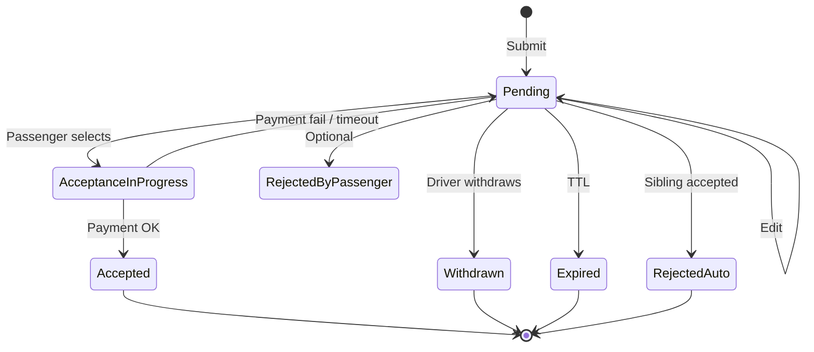

# 07 — Driver Bidding Engine

## 1. Purpose

Core differentiator: drivers compete with **priced offers**; passengers choose. (**CONFIRMED** reference model.)

All numeric TTLs, min/max margins, and ranking weights below are **ASSUMPTION / RECOMMENDED IMPLEMENTATION**.

---

## 2. Entities

| Entity | Role |
|--------|------|
| `RideRequest` | Demand tender |
| `DriverOffer` | Bid |
| `OfferExtra` | Included/paid extras |
| `PriceSuggestion` | Advisory (optional) |

---

## 3. Driver flow

```text
View Available Request → Select Vehicle → Enter Price → Add Conditions/Details → Submit Offer
```

### Offer payload

- `request_id`, `driver_id`, `vehicle_id`  
- `currency`, `amount_minor` (integer cents)  
- `includes` (waiting, meet & greet, tolls — booleans/text)  
- `cancellation_policy_id` or snapshot JSON  
- `notes` (passenger-visible)  
- `expires_at`  
- Optional: `estimated_arrival_buffer_minutes` for urgent  

---

## 4. Pricing rules

| Rule | Recommendation |
|------|----------------|
| Currency | Must match request currency |
| Min price | Floor by distance × class × country config |
| Max price | Cap to reduce mistakes/fraud (e.g., 5× suggestion) |
| Recommended price | Shown to driver; optional passenger “budget” |
| Edits | Allowed while `pending` and before acceptance lock |
| Withdraw | Sets `withdrawn`; frees driver to re-bid if allowed |
| Duplicates | One **active** offer per (`driver_id`,`request_id`) unique constraint |
| Commission preview | Show estimated net earnings before submit |

---

## 5. Expiration

| Timer | Typical | Effect |
|-------|---------|--------|
| Request TTL | 48h advance; 2h urgent | `expired`; offers expired |
| Offer TTL | 12–24h or until request end | Offer `expired` |
| Acceptance lock TTL | 10–15 min for payment | Release if unpaid |

Jobs: `ExpireOffersJob`, `ExpireRequestsJob`.

---

## 6. Offer ranking (passenger list)

Default **Recommended** score (**RECOMMENDED** formula — tune with data):

```text
score =
  w1 * normalize(inverse price)
+ w2 * rating
+ w3 * log(1 + completed_trips)
+ w4 * vehicle_class_match
+ w5 * recency
+ w6 * photo_quality_flag
− penalties (new account, cancel rate)
```

Other sorts: lowest price, highest rated, best vehicle (class/year/capacity), newest.

---

## 7. Fraud & spam prevention

| Control | Detail |
|---------|--------|
| Rate limit | Offers per hour per driver |
| Self-deal block | Same person / linked accounts / shared devices — **CONFIRMED** concern in reference KYC |
| Price outliers | Flag for review |
| Photo reuse detection | Phase 2 |
| Impossible concurrency | Overlapping bookings rejected |
| Soft ban | Temporary feed restriction |

---

## 8. Passenger actions

| Action | Result |
|--------|--------|
| View offer | Analytics event |
| Accept | Payment flow |
| Ignore | No status change |
| Explicit reject | Optional `rejected_by_passenger` |
| Wait | Remain on request |
| Contact support | Ticket |

---

## 9. State machine — DriverOffer



Invalid transitions must 409 from API.

---

## 10. Currency conversion

- Store amounts in **minor units** + `currency`.  
- Display convert via daily FX table if multi-currency browse — **MVP:** single currency per request.  
- Settlement currency may differ for payouts (driver payout currency).

---

## 11. Events

`DriverOfferSubmitted`, `DriverOfferUpdated`, `DriverOfferWithdrawn`, `OfferAccepted`, `OfferExpired`, `OfferRejectedAuto`.
