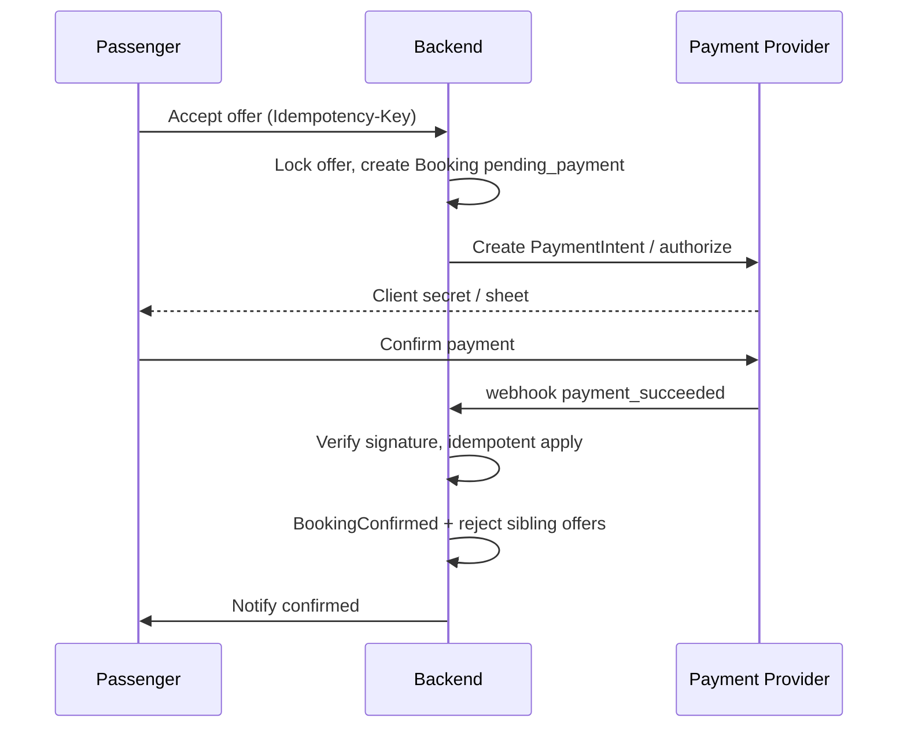
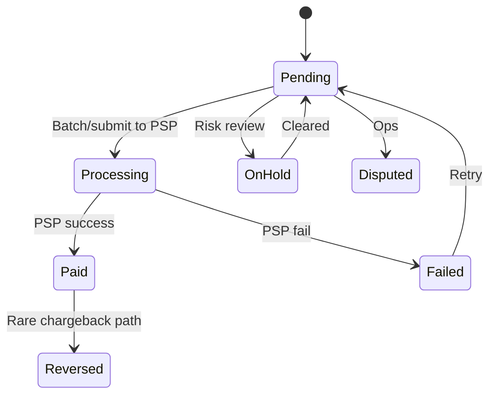

# 08 — Payments, Wallet, Commission, Payouts & Refunds

## 1. Principles

- Provider-agnostic **PaymentPort** interface (Stripe first).  
- **Never** store raw card numbers / CVV.  
- Tokenization via PSP.  
- Idempotency on all money mutations.  
- Backend ledger is source of truth.  
- Cash only where country config allows (**CONFIRMED** exists on reference in some countries).

---

## 2. Payment methods

| Method | MVP | Notes |
|--------|-----|-------|
| Card (tokenized) | Yes | Authorize + capture |
| Apple Pay / Google Pay | Phase 2 | Via PSP |
| PayPal | Phase 2 | |
| Adyen | Alternate adapter | |
| Cash | Optional | Mark booking `cash`; different capture rules |

---

## 3. Payment flow (card)



### States — Payment

`created` → `requires_action` → `authorized` → `captured` → `failed` / `cancelled`  
Refunds: `refund_pending` → `refunded` / `refund_failed`

### Capture strategies (**open question**)

| Strategy | When |
|----------|------|
| A. Capture on booking confirm | Simpler; refunds on cancel |
| B. Authorize now, capture on trip start/complete | Better for long-lead cancels; auth expiry risk |

**RECOMMENDED MVP:** Capture on confirm; policy-based refunds.

---

## 4. Price breakdown

```text
driver_offer_amount
+ platform_passenger_fee (optional)
+ tax
− promo_discount
= passenger_total
```

```text
driver_offer_amount
− platform_commission
− payment_processing_share (if charged to driver — avoid if possible)
± adjustments (tips, penalties, bonuses)
= driver_net_earning
```

Persist **snapshots** on booking so later rule changes don’t rewrite history.

---

## 5. Commission engine

Admin-configurable rules (priority ordered):

1. Driver-specific override  
2. Promotion campaign  
3. Vehicle class + service type  
4. City  
5. Country  
6. Global default  

Fields: `percent_bps` and/or `fixed_minor`, `currency`, date range, service types.

Urgent ride lower commission is a **possible** rule (**public claim** on reference for 5% urgent) — configure, don’t hard-code.

---

## 6. Tips

Post-trip tip PaymentIntent → 100% to driver (minus PSP fee policy). Phase 2 acceptable.

---

## 7. Cancellation fees & refunds

Policy inputs: hours_to_pickup, actor, reason, country, service.

Outputs: `refund_percent`, `fee_minor`, `driver_compensation_minor`, `platform_retained_minor`.

| Scenario | Guidance |
|----------|----------|
| Before accept | 100% no charge |
| After confirm, early | High refund % |
| Late cancel | Fee / low refund |
| Driver cancel | Full refund passenger; driver penalty |
| Passenger no-show | Fee to driver per policy |
| Driver no-show | Full refund + driver penalty |
| Flight delay beyond wait | Support / auto extend — Phase 2 |
| Force majeure | Manual / special policy |

Partial refunds supported. Refund provider failures → `refund_failed` + ops queue.

---

## 8. Driver wallet

### Balances

| Balance | Meaning |
|---------|---------|
| Pending | Earned but in hold period (chargeback/dispute window) |
| Available | Withdrawable |
| Reserved | Linked to payout in flight |

### Wallet transactions (append-only ledger)

Types: `trip_earning`, `commission`, `tip`, `refund_clawback`, `adjustment`, `payout`, `bonus`, `penalty`.

Never update balances without inserting ledger rows in the same DB transaction.

---

## 9. Payouts



Admin reconciliation: expected vs PSP settlement reports.

---

## 10. Webhooks

- Verify signatures.  
- Store raw payload.  
- Idempotent handlers (`event_id` unique).  
- Delayed webhook: client polling + reconcile job.  
- Duplicate webhook: no-op.

---

## 11. Multi-currency

- Request/booking in one currency.  
- Platform may convert for reporting using FX table.  
- Driver payout currency may equal local bank currency.

---

## 12. Promo codes (Phase 2)

Validate: active, limits, min booking, geo, user eligibility → discount on passenger_total; funding from platform marketing budget (not silently from driver).
