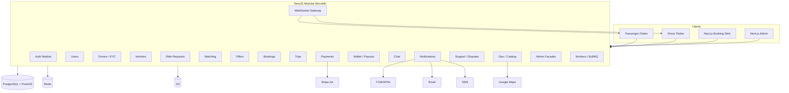

# 09 — System Architecture

## 1. Style

**Modular monolith** + **event-driven** side effects.  
Deploy economically; extract services only when scale demands.

---

## 2. Technology decision

### Mobile — Flutter (**RECOMMENDED**)

| Pros | Cons |
|------|------|
| One team, iOS+Android | Native module edge cases |
| Shared packages (UI, API client, maps) | Large app size |
| Fast iteration | |

**Structure:** monorepo with `apps/passenger`, `apps/driver`, `packages/*`.

### Backend — NestJS vs Laravel

| Criterion | NestJS | Laravel |
|-----------|--------|---------|
| Dev speed CRUD/admin | Good | Excellent (+ Filament) |
| WebSockets / realtime | Excellent (native) | Good (beyond + Soketi) |
| Marketplace domain / DI | Excellent | Good |
| TS end-to-end with Next | Strong | Weaker |
| Hiring | Strong in startup/Node | Strong globally |
| Queues | BullMQ excellent | Horizon excellent |

**Recommendation: NestJS** for TransferMarket due to realtime + TypeScript alignment with Next admin/web.  
Laravel remains acceptable if team is PHP-heavy — then Admin = Filament.

### Data

- PostgreSQL + PostGIS  
- Redis cache/queues/pub-sub  
- S3-compatible private/public buckets  

### Maps

**MVP: Google Maps Platform** (Places, Geocoding, Directions, Maps SDK).  
Revisit Mapbox for cost/customization later.

---

## 3. Module boundaries (future services)

| Module | Extract when |
|--------|--------------|
| Matching | CPU-heavy geo fan-out |
| Location | High write QPS for GPS |
| Notification | Multi-channel volume |
| Payment | PCI/compliance isolation |
| Chat | Independent scaling |
| Analytics | Warehouse pipelines |

---

## 4. API style

- REST JSON `/api/v1`  
- OpenAPI generated  
- WebSockets `/ws` with JWT  
- Webhooks `/api/v1/webhooks/{provider}`  

---

## 5. Background jobs

Offer/request expiration, notifications, flight sync, payment reconcile, payouts, document expiry, reminders, fraud checks, stale cleanup, analytics rollups.

---

## 6. Environments

`local` → `dev` → `staging` → `production`  
Per-env secrets via vault/SM; never in git.

---

## 7. Scalability path

1. Vertical scale monolith + managed Postgres  
2. Read replicas for heavy admin/report reads  
3. Separate worker dynos  
4. WS sticky sessions / Redis adapter  
5. Extract Location service if GPS writes dominate  

---

## 8. Development rules for implementation

- No business logic in controllers  
- Domain/services + DTOs + validation pipes  
- Repositories where beneficial  
- Enums for statuses; reject illegal transitions  
- DB transactions for multi-row money/booking ops  
- Idempotency keys for payment/booking  
- Queues + domain events for side effects  
- Policies/guards for permissions  
- Serializers/resources; pagination; avoid N+1  
- Selective Redis caching  
- PostGIS for spatial  
- Backend authoritative  
- No payment secrets on clients  
- No raw card storage  
- Private docs via short-lived signed URLs  
- Audit sensitive admin actions  
- Automated tests for critical workflows  

---

## 9. Observability

Structured logs (JSON), OpenTelemetry traces, error tracking (Sentry), metrics (Prometheus/Grafana or cloud), mobile crash reporting, queue dashboards, webhook logs.
