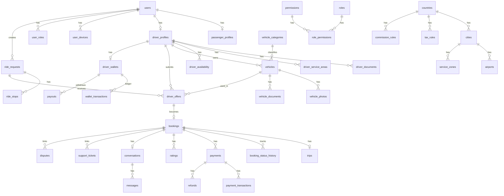

# 10 — Database Schema

**DB:** PostgreSQL 16+ with **PostGIS**.  
**Conventions:** UUID PKs (`gen_random_uuid()`), `created_at`/`updated_at`, soft deletes via `deleted_at` where noted, money as `BIGINT` minor units + `CHAR(3)` currency, geospatial `geography(Point,4326)` / `geography(Polygon,4326)`.

All schema is **ASSUMPTION / RECOMMENDED** for TransferMarket (reference schema unknown).

---

## 1. ER overview

---

## 2. Identity & access

### users
| Column | Type | Notes |
|--------|------|-------|
| id | UUID PK | |
| email | CITEXT UNIQUE | nullable until set |
| phone_e164 | VARCHAR UNIQUE | |
| password_hash | TEXT | nullable if OTP-only |
| status | ENUM | active, suspended, deleted_pending |
| email_verified_at | TIMESTAMPTZ | |
| phone_verified_at | TIMESTAMPTZ | |
| locale | VARCHAR | |
| preferred_currency | CHAR(3) | |
| deleted_at | TIMESTAMPTZ | soft |

### user_profiles
Display name, avatar_url, country_id, timezone, marketing_opt_in.

### user_devices
device_id, platform, push_token, app_version, last_seen_at.

### roles / permissions / user_roles / role_permissions
Classic RBAC. Drivers/passengers may be role flags on profile rather than only RBAC — **RECOMMENDED:** `users` + `user_roles` for staff; `passenger_profiles` / `driver_profiles` for marketplace actors.

---

## 3. Driver & vehicles

### driver_profiles
user_id UNIQUE, verification_status, rating_avg, rating_count, trips_completed, is_online, last_location geography(Point), last_location_at, payout_currency.

### driver_documents
type, storage_key, status, expires_on, reviewer_id, reviewed_at, reject_reason.

### driver_service_areas
driver_id, name, area geography(Polygon) OR center+radius_m, is_primary.

### driver_availability
weekly JSONB schedule, blocked date ranges table `driver_blocked_dates`.

### vehicle_categories
code, name_i18n JSONB, sort_order, active.

### vehicles
driver_id, category_id, make, model, year, color, plate, vin, pax_capacity, luggage_capacity, features JSONB, status, …

### vehicle_photos / vehicle_documents
storage_key, sort_order / type, status, expires_on.

---

## 4. Marketplace

### ride_requests
| Column | Type |
|--------|------|
| id | UUID PK |
| public_code | VARCHAR UNIQUE |
| passenger_id | UUID FK |
| service_type | ENUM transfer, return, airport, hourly, long_distance, delivery, urgent |
| status | ENUM |
| pickup | geography(Point) NOT NULL |
| pickup_address | TEXT |
| dropoff | geography(Point) | nullable hourly |
| dropoff_address | TEXT |
| scheduled_at | TIMESTAMPTZ |
| timezone | VARCHAR |
| passenger_count | INT |
| child_seats JSONB | |
| luggage_count | INT |
| vehicle_category_id | UUID nullable |
| flight_number | VARCHAR |
| airline | VARCHAR |
| terminal | VARCHAR |
| meet_and_greet | BOOL |
| notes | TEXT |
| accessibility JSONB | |
| currency | CHAR(3) |
| group_id | UUID | link return pair |
| expires_at | TIMESTAMPTZ |
| country_id / city_id | FKs |

**Indexes:** GIST on pickup; `(status, expires_at)`; `(passenger_id, created_at DESC)`.

### ride_stops
request_id, seq, location geography, address.

### driver_offers
request_id, driver_id, vehicle_id, amount_minor, currency, status, includes JSONB, cancellation_snapshot JSONB, notes, expires_at,  
**UNIQUE (request_id, driver_id) WHERE status IN active set**.

Indexes: `(request_id, status)`, `(driver_id, created_at DESC)`.

---

## 5. Booking & trip

### bookings
public_code, request_id, offer_id UNIQUE, passenger_id, driver_id, vehicle_id, status, scheduled_at, price_snapshot JSONB, commission_snapshot JSONB, cancellation_policy_snapshot JSONB, confirmed_at, …

### booking_status_history
booking_id, from_status, to_status, actor_type, actor_id, meta JSONB, created_at.

### trips
booking_id UNIQUE, started_at, completed_at, distance_m, duration_s, …

### trip_locations
trip_id, recorded_at, location geography, speed, heading.  
**Partition by month** if volume high. TTL retention job.

---

## 6. Payments & wallet

### payments
booking_id, provider, provider_payment_id UNIQUE, amount_minor, currency, status, idempotency_key UNIQUE, raw metadata.

### payment_transactions
payment_id, type, provider_event_id UNIQUE, amount_minor, status, payload JSONB.

### refunds
payment_id, amount_minor, reason, status, provider_refund_id.

### driver_wallets
driver_id UNIQUE, available_minor, pending_minor, currency.

### wallet_transactions
wallet_id, type, amount_minor, booking_id nullable, payout_id nullable, balance_after_minor, idempotency_key UNIQUE.

### payouts
wallet_id, amount_minor, status, provider_transfer_id, processed_at, failure_reason.

### commission_rules
scope fields + percent_bps + fixed_minor + priority + active window.

---

## 7. Comms & trust

### conversations / messages
booking_id, sender_id, type (user/system), body, attachments JSONB, read_at.

### notifications
user_id, channel, template_key, payload, status, sent_at.

### ratings / reviews
booking_id, rater_id, ratee_id, scores JSONB, body, moderation_status.  
**UNIQUE (booking_id, rater_id)**.

### support_tickets / support_messages
### disputes / dispute_evidence

---

## 8. Geo & config

### countries, regions, cities, airports, service_zones
airports: iata, location, waiting_policy_id.  
service_zones: polygon, city_id.

### currencies, tax_rules, cancellation_policies, waiting_policies, system_settings
### promotions / promo_redemptions
### audit_logs
actor, action, entity_type, entity_id, before/after JSONB, ip, created_at.

---

## 9. Soft deletes & audit

- Soft delete users, vehicles, content.  
- **Never** soft-delete ledger rows; void with compensating transactions.  
- Financial tables immutable except status fields.

---

## 10. Normalization notes

- Snapshot JSON on bookings for price/policy (intentional denormalization).  
- i18n names as JSONB or `*_translations` tables — JSONB OK for MVP catalog.
