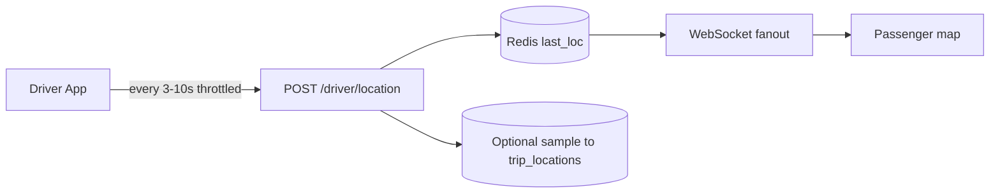

# 12 — Realtime & Location Architecture

## 1. Maps provider comparison

| Criterion | Google Maps | Mapbox |
|-----------|-------------|--------|
| Places autocomplete | Excellent | Good |
| Geocoding | Excellent | Good |
| Mobile SDKs | Mature | Mature |
| Pricing | Can be high at scale | Often flexible |
| Styling | Limited | Strong |
| Directions/ETA | Excellent | Good |

**MVP recommendation: Google Maps Platform.** Abstract behind `MapsPort` for future switch.

**CONFIRMED:** Reference apps are map-heavy travel products; exact vendor unknown.

---

## 2. Passenger map features

| Feature | Behavior |
|---------|----------|
| Places autocomplete | Debounced server proxy |
| Current location | One-shot + accuracy check |
| Pickup pin adjust | Drag → reverse geocode |
| Destination pin | Same |
| Route visualization | Directions polyline |
| Distance / duration | From Directions; store estimate on request |
| Multiple stops | Waypoints ordered |
| Saved addresses | Home/Work/Recent |
| Airport detection | Place types + airports table snap |
| GPS denied | Search-only mode + banner |

---

## 3. Driver location pipeline

### Rules

- Update only when online or on active trip.  
- Distance/time throttle (e.g., ≥25m or ≥5s).  
- Drop inaccurate points (accuracy > 50–100m).  
- On trip: persist samples; off trip: Redis only.  
- Background location: OS disclosure; purpose limited.

**CONFIRMED:** Reference driver app may use location when not open (App Store). Implement with consent.

---

## 4. WebSockets

**Channels (recommended):**

| Channel | Members | Events |
|---------|---------|--------|
| `user:{id}` | Self | notifications, offer updates |
| `request:{id}` | Passenger | `offer.created`, `request.expired` |
| `booking:{id}` | Passenger+Driver | status, chat, location |
| `driver:{id}` | Driver | marketplace hints |

Auth: JWT on connect; authorize channel join server-side.

Fallback: polling every 15–30s if WS down.

---

## 5. ETA

- Pre-trip: Directions API ETA to pickup.  
- On-trip: recompute periodically; cache 15–30s.  
- Show confidence / last updated time.

---

## 6. Geofence assists (soft)

| Event | Hint |
|-------|------|
| Arrived | Within XXm of pickup |
| Complete | Near dropoff |

Never solely trust client geofence — driver still taps actions; ops can override.

---

## 7. Matching geo

PostGIS:

- Drivers whose service area intersects pickup  
- Optional `ST_DWithin` for urgent radius  
- Index GIST on areas and pickup points  

---

## 8. Offline / permission edge cases

| Case | Behavior |
|------|----------|
| Passenger offline | Queue UI; sync on reconnect |
| Driver offline mid-trip | Last known location + “connection lost”; status actions queue locally then flush |
| GPS disabled | Block urgent; warn on active trip; allow scheduled offer management |
| GPS drift | Snap to road optional Phase 2; smooth on client |

Detail matrix: [17-edge-cases.md](./17-edge-cases.md).
