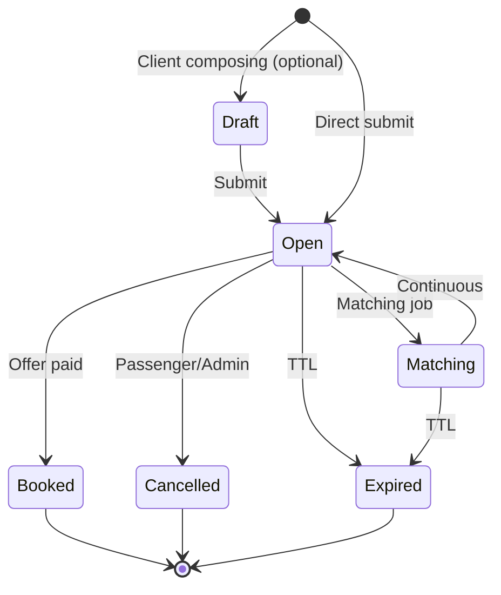
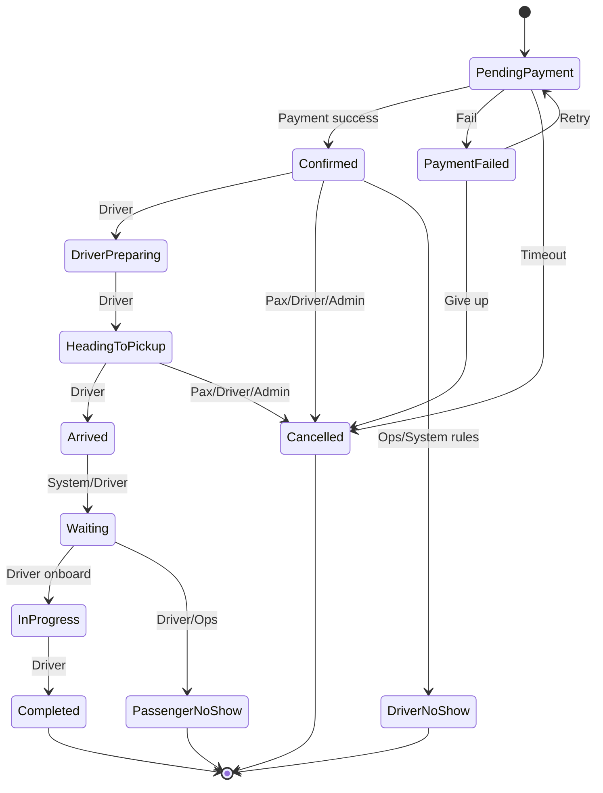

# 16 — State Machines

Backend must reject illegal transitions with `409 INVALID_STATE`.  
All machines below are **ASSUMPTION / RECOMMENDED** for TransferMarket.

---

## 1. Ride Request

| From | To | Actor |
|------|----|-------|
| → Open | Passenger | |
| Open → Cancelled | Passenger, Admin | |
| Open → Expired | System | |
| Open → Booked | System after payment | |

---

## 2. Driver Offer

See [07-driver-bidding-engine.md](./07-driver-bidding-engine.md).  
States: `pending`, `acceptance_in_progress`, `accepted`, `withdrawn`, `expired`, `rejected_auto`, `rejected_by_passenger`.

---

## 3. Booking

---

## 4. Trip (may mirror booking substates)

Active trip record created at `HeadingToPickup` or `Confirmed` — **RECOMMENDED** create at first driver movement status.

---

## 5. Payment / Refund / Payout

Documented in [08-payment-wallet-payouts.md](./08-payment-wallet-payouts.md).

---

## 6. Driver verification

`draft` → `submitted` → `under_review` → `approved` | `rejected` → (from approved) `suspended` → `approved` (reactivate).

---

## 7. Vehicle verification

`draft` → `pending_verification` → `approved` | `rejected` → `suspended` | `expired_documents`.

---

## 8. Dispute

`open` → `assigned` → `waiting_customer` / `waiting_driver` → `under_investigation` → `resolved` | `rejected` | `refunded` → `closed`.

---

## 9. Support ticket

`new` → `open` → `pending_user` → `on_hold` → `resolved` → `closed`  
Priority + SLA timers independent of status.

---

## 10. Urgent request overlays

Additional constraints while `service_type=urgent`:

- Only `online` drivers with fresh location  
- Shorter TTLs  
- May require live location before offer accept  

---

## 11. Who can trigger trip statuses

| Status | Driver | Passenger | System | Admin |
|--------|:------:|:---------:|:------:|:-----:|
| DriverPreparing | ✓ | — | — | ✓ |
| HeadingToPickup | ✓ | — | — | ✓ |
| Arrived | ✓ | — | soft geo hint | ✓ |
| Waiting | ✓ | — | auto from Arrived | ✓ |
| InProgress | ✓ | — | — | ✓ |
| Completed | ✓ | — | — | ✓ |
| PassengerNoShow | ✓ | — | — | ✓ |
| DriverNoShow | — | report | rules | ✓ |
| Cancelled | ✓* | ✓* | policy | ✓ |

\*Subject to policy windows and fees.
