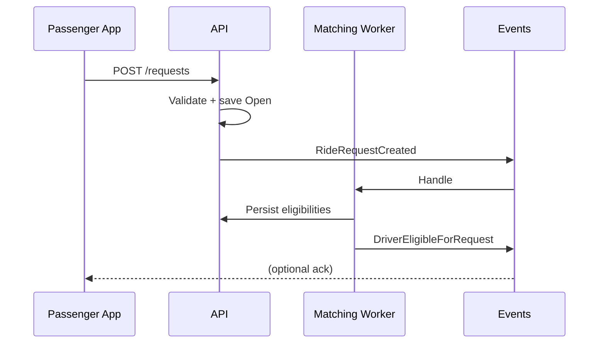
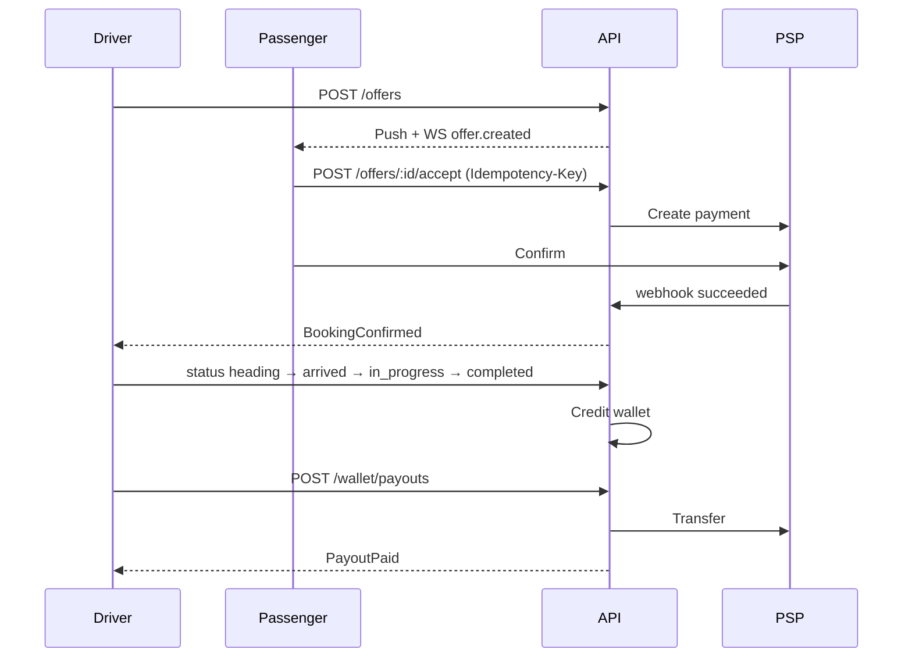

# 24 — Assumptions & Open Questions

## 1. How to read this

Anything not **CONFIRMED** from public GetTransfer materials is either **INFERRED** or **ASSUMPTION / RECOMMENDED**. This file lists decisions that **block** correct implementation if unanswered.

---

## 2. Open questions (business owner)

### Legal / market

1. What is the official product/legal brand name and merchant-of-record entity?  
2. Which **first country/city** launches?  
3. Is the platform legally positioned strictly as an intermediary in all launch markets?  
4. Required insurance minimums per market?  

### Commercial

5. Default commission % and structure (driver-side vs passenger fee vs both)?  
6. Urgent-ride commission override?  
7. Who pays PSP fees?  
8. Payout cadence and minimum threshold?  
9. Tip support in MVP?  

### Product policy

10. Capture-on-confirm vs authorize-then-capture?  
11. Cash in MVP for launch country?  
12. Cancellation matrix (hours → refund %)?  
13. Free waiting minutes by location type (mirror reference 60/30/15 or custom)?  
14. Return trips: one bid for pair vs separate bids?  
15. Can drivers rate passengers?  
16. Guest web checkout allowed?  
17. Delivery/courier in roadmap priority?  
18. Masked calling MVP or Phase 2?  
19. Max concurrent future bookings per driver?  
20. Offer ranking weights / “Recommended” disclosure?  

### Trust & safety

21. Background check provider?  
22. Mandatory admin approval before first offer (assumed **yes**)?  
23. Self-deal detection beyond same user_id (device graphs)?  

### Tech

24. Confirm NestJS vs Laravel given team skills?  
25. Google Maps vs Mapbox budget?  
26. Stripe only vs multi-PSP year one?  
27. Data residency requirements?  

---

## 3. Documented assumptions (defaults if unanswered)

| Topic | Default assumption |
|-------|--------------------|
| Backend | NestJS modular monolith |
| Mobile | Flutter dual apps |
| Admin/Web | Next.js |
| DB | PostgreSQL + PostGIS |
| Payments | Stripe; capture on confirm |
| Commission | Configurable; start country default e.g. 15% **placeholder only** |
| Waiting | 60/30/15 minutes airport/rail/other (**inspired by CONFIRMED FAQ**, configurable) |
| KYC gate | Required before marketplace |
| Chat | After booking confirm |
| Currency | One currency per request |
| i18n | English first, key-based |
| Architecture | No microservices at launch |
| Reassign | Ops-only under strict rules |

---

## 4. Product improvements ledger

| Reference behavior | Problem | Our improvement |
|--------------------|---------|-----------------|
| Driver-set prices via tender (**CONFIRMED**) | Passenger wait uncertainty | Time-to-first-offer UX + extend request |
| Photos/ratings before pay (**CONFIRMED**) | Hard to compare | Sort/filter + fee-inclusive totals |
| Waiting rules in FAQ (**CONFIRMED**) | Easy to miss | Show on offer + booking |
| Low urgent commission claim (public interview) | Opacity | Commission preview for drivers |
| Cash in some countries (**CONFIRMED** notes) | Reconciliation risk | Country flag + ops tools |
| Intermediary disclaimer (**CONFIRMED**) | Liability confusion | Clear in-app status of roles |
| Payout issues (secondary complaints) | Driver churn | Ledger, statuses, SLAs |
| Support if driver unreachable (**CONFIRMED** FAQ path) | Slow | Booking tickets + SLA + Phase 2 masked call |

---

## 5. Sequence diagrams (canonical)

### Passenger creates request

### Driver submits offer → passenger accepts → pay → trip → payout

---

## 6. Sign-off

Until sign-off, engineering should not treat fee percentages or launch country as final.
