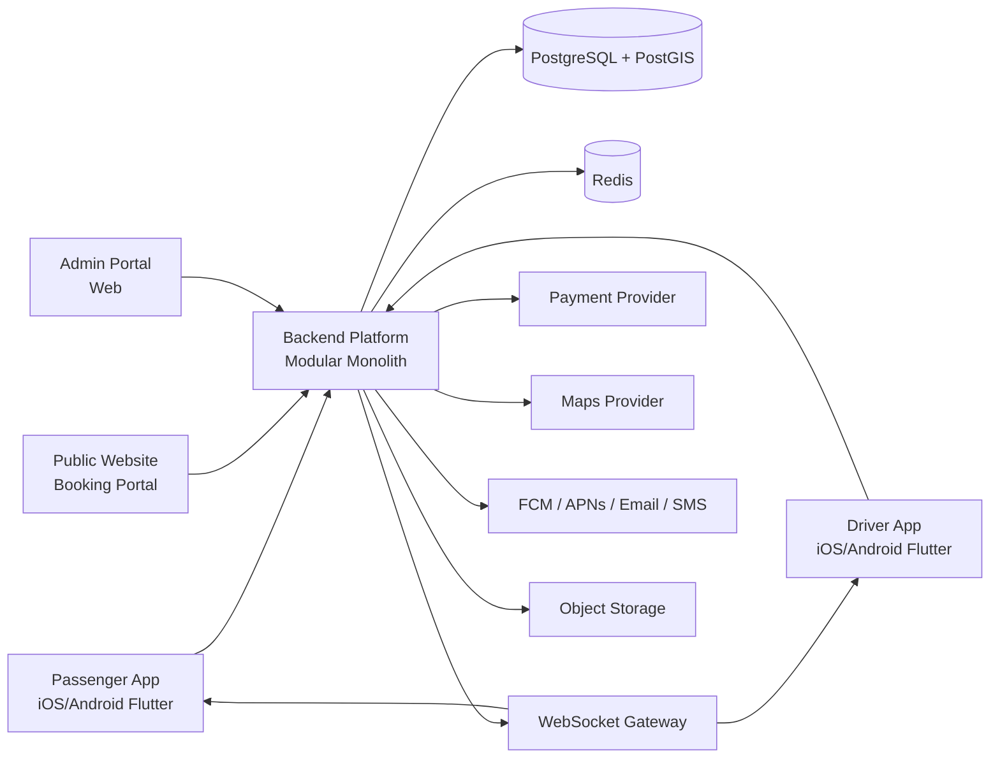

# TransferMarket — Master Documentation Index

> **Product codename:** TransferMarket  
> **Status:** Product definition / pre-implementation  
> **Rule:** Do **not** implement application source code until this documentation set is reviewed and approved.

This repository documentation defines an original, production-grade **transportation marketplace** inspired by the *business model and workflows* of GetTransfer (passenger + driver apps). It does **not** copy proprietary source code, branding, copyrighted assets, or pixel-identical UI.

---

## How to use this documentation

| Audience | Start here |
|----------|------------|
| Product / business owners | [00-executive-summary.md](./00-executive-summary.md), [02-business-model.md](./02-business-model.md), [22-mvp-roadmap.md](./22-mvp-roadmap.md) |
| Engineering leads | [09-system-architecture.md](./09-system-architecture.md), [10-database-schema.md](./10-database-schema.md), [11-api-specification.md](./11-api-specification.md) |
| Mobile developers | [03-passenger-app-requirements.md](./03-passenger-app-requirements.md), [04-driver-app-requirements.md](./04-driver-app-requirements.md), [18-ui-screen-inventory.md](./18-ui-screen-inventory.md) |
| Backend developers | [06-booking-marketplace-workflow.md](./06-booking-marketplace-workflow.md), [07-driver-bidding-engine.md](./07-driver-bidding-engine.md), [16-state-machines.md](./16-state-machines.md) |
| Ops / support / finance | [05-admin-portal-requirements.md](./05-admin-portal-requirements.md), [08-payment-wallet-payouts.md](./08-payment-wallet-payouts.md), [15-roles-permissions.md](./15-roles-permissions.md) |
| Security / compliance | [14-security-compliance.md](./14-security-compliance.md) |
| QA | [19-testing-strategy.md](./19-testing-strategy.md), [17-edge-cases.md](./17-edge-cases.md) |
| DevOps | [20-devops-deployment.md](./20-devops-deployment.md) |

### Evidence legend (used across all docs)

| Label | Meaning |
|-------|---------|
| **CONFIRMED** | Verified from public App Store listings, GetTransfer.com FAQ/marketing, carrier pages, or other public references |
| **INFERRED** | Reasonable product inference from public UX patterns / marketplace norms; not explicitly confirmed |
| **ASSUMPTION / RECOMMENDED IMPLEMENTATION** | Our product decision; not claimed as GetTransfer behavior |

Unresolved items live in [24-assumptions-open-questions.md](./24-assumptions-open-questions.md).

---

## Client proposal

| File | Purpose |
|------|---------|
| [CAN-GO-Development-Proposal.html](./CAN-GO-Development-Proposal.html) | **Primary client proposal** — full page; CSS scoped to `.cango-proposal` (CRM-safe) |
| [CAN-GO-Development-Proposal-embed.html](./CAN-GO-Development-Proposal-embed.html) | **CRM embed fragment** — scoped CSS, no `<script>` (PWS crashes on scripts); native page scroll so browser Find (Ctrl+F) jumps to matches |
| [TransferMarket-Development-Proposal.html](./TransferMarket-Development-Proposal.html) | Same file (alias copy) |
| [generate_proposal.py](./generate_proposal.py) | Regenerates HTML — run from `docs/`: `python generate_proposal.py` |
| [proposal_ui.py](./proposal_ui.py) | Full P/D/A screen library + per-section visual injection map |

## Document map

| # | File | Purpose |
|---|------|---------|
| 00 | [00-executive-summary.md](./00-executive-summary.md) | Product summary, architecture recommendation, MVP, risks |
| 01 | [01-reference-app-analysis.md](./01-reference-app-analysis.md) | GetTransfer public analysis (confirmed vs inferred) |
| 02 | [02-business-model.md](./02-business-model.md) | Marketplace economics, roles, value exchange |
| 03 | [03-passenger-app-requirements.md](./03-passenger-app-requirements.md) | Passenger mobile + web booking requirements |
| 04 | [04-driver-app-requirements.md](./04-driver-app-requirements.md) | Driver/carrier app requirements |
| 05 | [05-admin-portal-requirements.md](./05-admin-portal-requirements.md) | Admin / operations portal |
| 06 | [06-booking-marketplace-workflow.md](./06-booking-marketplace-workflow.md) | End-to-end booking lifecycle |
| 07 | [07-driver-bidding-engine.md](./07-driver-bidding-engine.md) | Offers, ranking, expiration, fraud controls |
| 08 | [08-payment-wallet-payouts.md](./08-payment-wallet-payouts.md) | Payments, commission, wallet, payouts, refunds |
| 09 | [09-system-architecture.md](./09-system-architecture.md) | Modular monolith, tech stack, scalability |
| 10 | [10-database-schema.md](./10-database-schema.md) | ERD, tables, indexes, PostGIS |
| 11 | [11-api-specification.md](./11-api-specification.md) | API domains and endpoint contracts |
| 12 | [12-realtime-location-architecture.md](./12-realtime-location-architecture.md) | Maps, GPS, WebSockets, live trip |
| 13 | [13-notifications-chat.md](./13-notifications-chat.md) | Push/email/SMS, chat, masked calling |
| 14 | [14-security-compliance.md](./14-security-compliance.md) | Auth, PII, payments, OWASP |
| 15 | [15-roles-permissions.md](./15-roles-permissions.md) | RBAC matrix |
| 16 | [16-state-machines.md](./16-state-machines.md) | Explicit status transitions |
| 17 | [17-edge-cases.md](./17-edge-cases.md) | Failure modes and recovery |
| 18 | [18-ui-screen-inventory.md](./18-ui-screen-inventory.md) | Screen-by-screen inventory |
| 19 | [19-testing-strategy.md](./19-testing-strategy.md) | Test pyramid and critical E2E |
| 20 | [20-devops-deployment.md](./20-devops-deployment.md) | Environments, CI/CD, observability |
| 21 | [21-analytics-reporting.md](./21-analytics-reporting.md) | Funnel and revenue metrics |
| 22 | [22-mvp-roadmap.md](./22-mvp-roadmap.md) | MVP vs Phase 2 vs Advanced |
| 23 | [23-development-phases.md](./23-development-phases.md) | Phased delivery + estimates |
| 24 | [24-assumptions-open-questions.md](./24-assumptions-open-questions.md) | Decisions needing business approval |

---

## Platform components

---

## Development rules (for future implementation)

See [09-system-architecture.md](./09-system-architecture.md#development-rules-for-implementation) for the full list. Highlights:

- No business logic in controllers; domain/service layers own rules
- Backend is authoritative; never trust mobile client state
- Idempotency for payment and booking mutations
- Events + queues for side effects
- Never store raw card data; never expose private documents publicly
- Enums for statuses; invalid transitions rejected server-side
- Automated tests for critical marketplace workflows

---

## Document ownership

| Role | Responsibility |
|------|----------------|
| Product Owner | Approve MVP scope, open questions, commission/cancellation policies |
| Solution Architect | Own architecture and API contracts |
| Tech Leads (Mobile/Backend/Admin) | Implement against approved specs |
| QA Lead | Traceability from requirements → test cases |

**Last updated:** 2026-08-27  
**Version:** 1.0.0-draft
